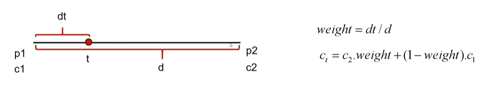
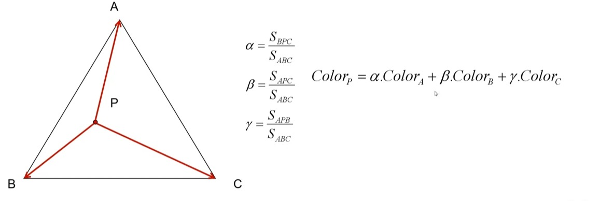
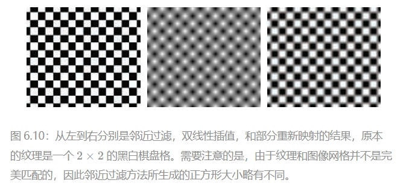
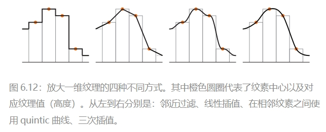

# 图形算法

<!-- TOC -->
* [图形算法](#图形算法)
  * [插值算法（Interpolation）](#插值算法interpolation)
    * [线性插值（Linear Interpolation）](#线性插值linear-interpolation)
    * [三角形颜色插值算法](#三角形颜色插值算法)
    * [邻近插值（Nearest Neighbor Interpolation）](#邻近插值nearest-neighbor-interpolation)
    * [双线性插值（Bilinear Interpolation）](#双线性插值bilinear-interpolation)
    * [三次插值（Cubic Interpolation）](#三次插值cubic-interpolation)
    * [双三次插值（Bicubic Interpolation）](#双三次插值bicubic-interpolation)
    * [插值算法示例](#插值算法示例)
<!-- TOC -->

---

## 插值算法（Interpolation）
> * **应用**： 颜色插值 、纹理坐标插值 、顶点属性插值
### 线性插值（Linear Interpolation）
* **定义**：已知的两个点之间，通过线性函数的计算方法，得到中间点的过程。
* **公式**：
  * $D(t) = D_0 + t(D_1 - D_0)$
  * 其中，$D(t)$ 是插值点，$D_0$ 和 $D_1$ 是已知的两个点，$t$ 是参数，取值范围为 $[0, 1]$。
  
  

### 三角形颜色插值算法
* **定义**：通过三角形重心坐标的计算方法，得到三角形内部任意点的颜色值的过程。
* **公式**：
  * $\alpha = \frac{S_{BPC}}{S_{ABC}}$
  * $\beta = \frac{S_{APC}}{S_{ABC}}$
  * $\gamma = \frac{S_{APB}}{S_{ABC}}$
  * $\text{Color}_P = \alpha \cdot \text{Color}_A + \beta \cdot \text{Color}_B + \gamma \cdot \text{Color}_C$

  

### 邻近插值（Nearest Neighbor Interpolation）
* **定义**：在二维空间中，通过取最近的已知点的颜色值，得到任意点颜色值的过程。
* **公式**：$\text{Color}_P = \text{Color}_{nearest}$

  

### 双线性插值（Bilinear Interpolation）
* **定义**：在二维空间中，通过对四个已知点的颜色值进行线性插值，得到任意点颜色值的过程。
* **公式**： $\text{Color}_P = (1 - x) \cdot (1 - y) \cdot \text{Color}_A + x \cdot (1 - y) \cdot \text{Color}_B + (1 - x) \cdot y \cdot \text{Color}_C + x \cdot y \cdot \text{Color}_D$
  
  

### 三次插值（Cubic Interpolation）
* **定义**：在二维空间中，通过对四个已知点的颜色值进行三次函数插值，得到任意点颜色值的过程。
* **公式**：$\text{Color}_P = (1 - t)^3 \cdot \text{Color}_A + 3 \cdot (1 - t)^2 \cdot t \cdot \text{Color}_B + 3 \cdot (1 - t) \cdot t^2 \cdot \text{Color}_C + t^3 \cdot \text{Color}_D$

### 双三次插值（Bicubic Interpolation）
* **定义**：在二维空间中，通过近的十六个采样点的加权平均得到任意点颜色值的过程。
* **公式**：$\text{Color}_P = (1 - x)^3 \cdot (1 - y)^3 \cdot \text{Color}_A + 3 \cdot (1 - x)^2 \cdot y \cdot (1 - y)^2 \cdot \text{Color}_B + 3 \cdot (1 - x) \cdot y^2 \cdot (1 - y)^2 \cdot \text{Color}_C + x^3 \cdot y^3 \cdot \text{Color}_D$

  

### 插值算法示例
、
、
