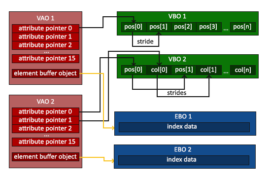
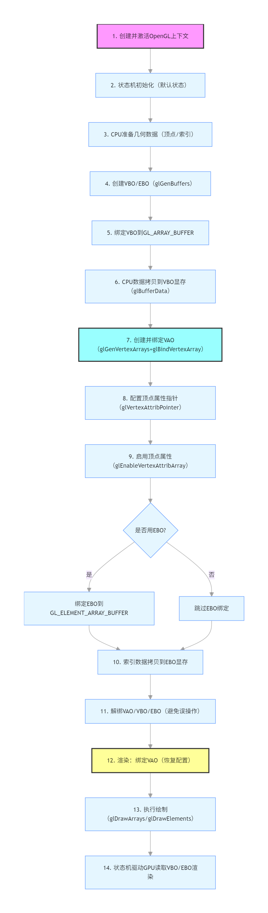
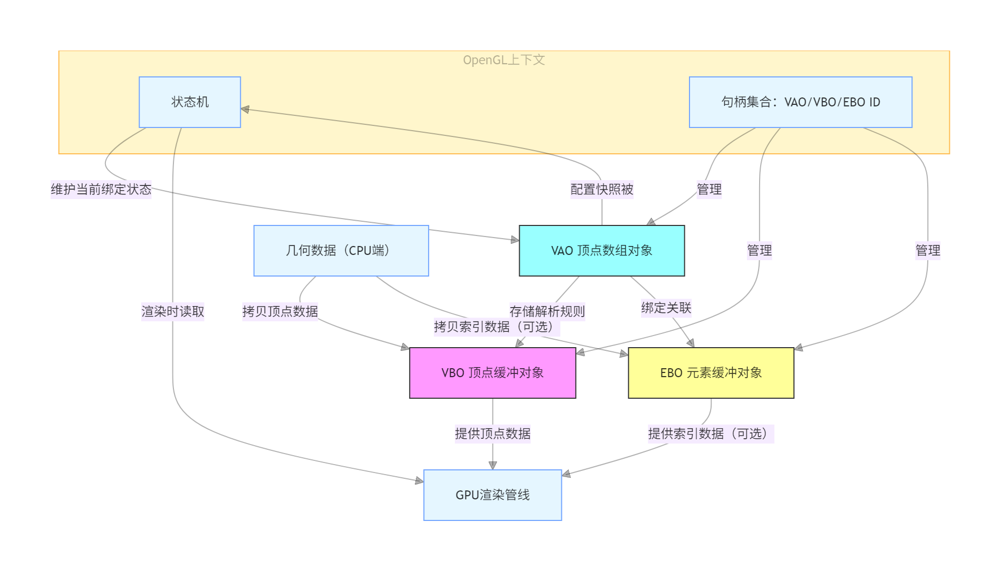
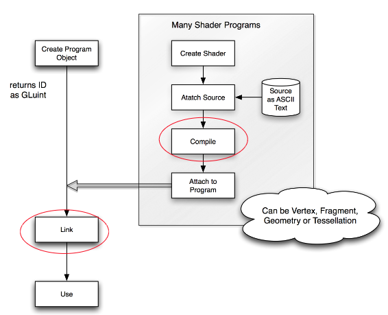
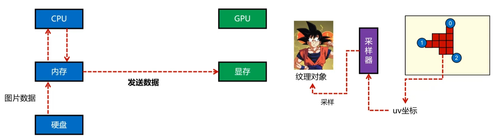
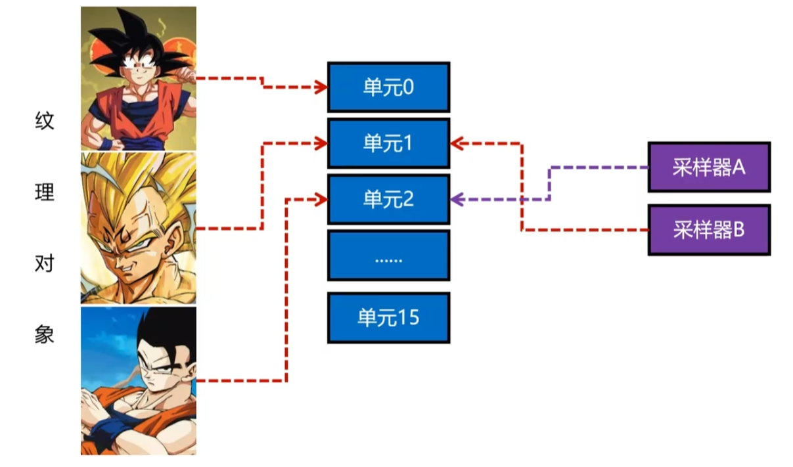
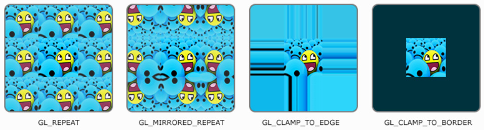
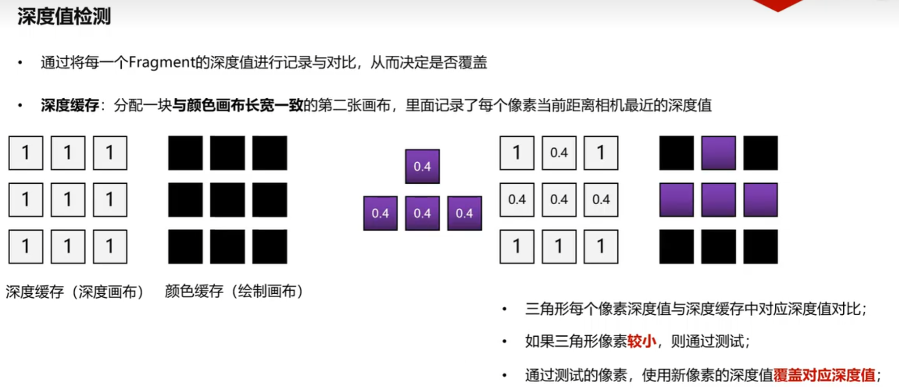
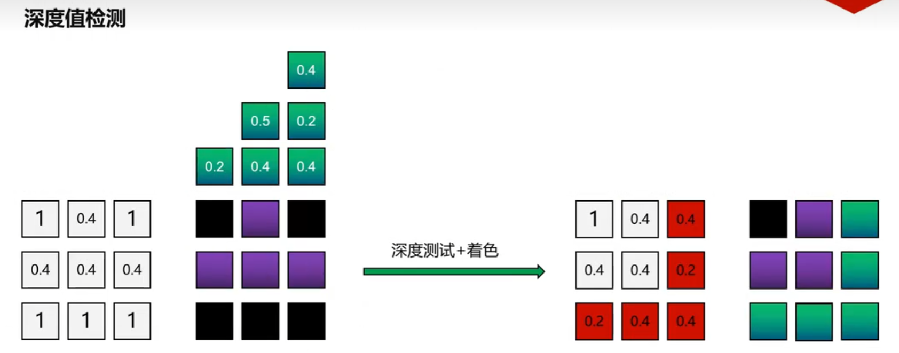

# Learn OpenGL

> **参考链接**
> * [OpenGL 中文文档](https://c-cn.readthedocs.io/zh/latest/)
> * [OpenGL (ES) 调试总结](https://robot9.me/opengl-es-debug/)
> * https://www.songho.ca/opengl/index.html
> * https://ai.feishu.cn/docx/W6Eod11C2onvCdxa347crqWunPh

---

<!-- TOC -->
* [Learn OpenGL](#learn-opengl)
  * [依赖库](#依赖库)
  * [词义解析](#词义解析)
    * [OpenGL上下文（Context）](#opengl上下文context)
    * [OpenGL状态机（State Machine）](#opengl状态机state-machine)
    * [数据缓冲区（Buffer Object）](#数据缓冲区buffer-object)
      * [VBO（Vertex Buffer Object，顶点缓冲对象）](#vbovertex-buffer-object顶点缓冲对象)
      * [VAO（Vertex Array Object，顶点数组对象）](#vaovertex-array-object顶点数组对象)
      * [EBO（Element Buffer Object，索引缓冲对象）](#eboelement-buffer-object索引缓冲对象)
    * [帧缓冲区（Framebuffer）](#帧缓冲区framebuffer)
    * [OpenGL双缓冲（Double Buffer）](#opengl双缓冲double-buffer)
      * [颜色缓冲区（Color Buffer）](#颜色缓冲区color-buffer)
      * [深度缓冲区（Depth Buffer/Z-Buffer）](#深度缓冲区depth-bufferz-buffer)
      * [模板缓冲区（Stencil Buffer）](#模板缓冲区stencil-buffer)
      * [渲染缓冲区对象（Renderbuffer Object, RBO）](#渲染缓冲区对象renderbuffer-object-rbo-)
      * [帧缓冲区对象（Frame Buffer Object, FBO）](#帧缓冲区对象frame-buffer-object-fbo)
    * [Shader（着色器）](#shader着色器)
    * [纹理&采样（Texture&Sampler）](#纹理采样texturesampler)
    * [深度检测（Depth Test）](#深度检测depth-test)
<!-- TOC -->

---

## 依赖库
* [GLFW](https://www.glfw.org/) ：专门针对OpenGL的C语言库,它提供了一些渲染物体所需需的最低限度的接口，如创建窗口、处理输入事件等。
* [GLAD](https://glad.dav1d.de/) ：根据不同的OpenGL版本,它提供了不同的函数指针,可以在不同的平台上使用，如在Windows上使用OpenGL 4.5,在macOS上使用OpenGL 4.1等。
* [GLEW](https://glew.sourceforge.net/) ：个跨平台的C++库,它提供了OpenGL的扩展功能，如加载OpenGL扩展函数指针等。
* [GLM](https://glm.g-truc.net/0.9.9/index.html) ：OpenGL的数学库,它提供了一些常用的数学操作,如向量、矩阵、四元数等，

---

## 词义解析
### OpenGL上下文（Context）
* **定义**：OpenGL上下文是一个对象,它包含了OpenGL运行环境的所有状态信息,如当前绑定的顶点数组对象、当前使用的着色器程序、当前设置的视口大小等。
* **作用**：OpenGL上下文是OpenGL运行环境的核心,它负责管理OpenGL的状态,并根据状态执行渲染操作。：是OpenGL的“物理载体”，解决“在哪里运行”的问题（提供资源和环境）。
* **本质**：一块独立的、包含 OpenGL所有运行所需资源的内存区域，是连接CPU代码与GPU的 “桥梁”。

### OpenGL状态机（State Machine）
* **定义**：OpenGL运行环境是一个大的状态机,每一个函数都会改变状态机的状态或者触发其执行某个行为。是一种 “存储当前状态+响应输入触发状态转换” 的系统。
* **作用**：是OpenGL的“逻辑规则”，解决“如何运行”的问题（操作依赖当前状态）。
* **核心分类**：OpenGL 的状态可分为三大类，覆盖了渲染的全流程：
    * **渲染配置状态**：启用/禁用深度测试（`glEnable(GL_DEPTH_TEST)`）、混合模式（`glBlendFunc`）、面剔除（`glCullFace`）等。
    * **资源绑定状态**：当前绑定的顶点数组对象（VAO）、顶点缓冲（VBO）、纹理（`glBindTexture`）、着色器程序（`glUseProgram`）等。
    * **参数配置状态**：视口大小（`glViewport`）、清屏颜色（`glClearColor`）、深度测试函数（`glDepthFunc`）等。
* **工作流程**：以 “渲染一个带纹理的三角形” 为例，状态机的流转逻辑：
    1. **初始化状态**：
        1. 设置清屏颜色：`glClearColor(0.1f, 0.1f, 0.1f, 1.0f)`（状态持久化）。
        2. 启用深度测试：`glEnable(GL_DEPTH_TEST)`（状态持久化）。
        3. 绑定 VAO：`glBindVertexArray(vaoID)`（当前 VAO 状态被激活）。
    2. **绑定资源状态**：
        1. 绑定 VBO 并上传顶点数据：`glBindBuffer(GL_ARRAY_BUFFER, vboID)`（操作依赖当前绑定的 VBO）。
        2. 绑定纹理并设置参数：`glBindTexture(GL_TEXTURE_2D, texID)` → `glTexParameteri(...)`（操作依赖当前绑定的纹理）。
        3. 激活着色器程序：`glUseProgram(shaderID)`（后续绘制使用该程序）。
    3. **执行渲染操作**：
        1. 清屏：`glClear(GL_COLOR_BUFFER_BIT | GL_DEPTH_BUFFER_BIT)`（依赖`glClearColor`状态）。
        2. 绘制三角形：`glDrawArrays(GL_TRIANGLES, 0, 3)`（依赖当前绑定的 VAO、着色器程序、纹理等状态）。
    4. **状态切换/重置**：
        1. 解绑纹理：`glBindTexture(GL_TEXTURE_2D, 0)`（重置 “当前纹理” 状态）。
        2. 停用着色器程序：`glUseProgram(0)`（重置 “当前程序” 状态）。

### 数据缓冲区（Buffer Object）
> 数据缓冲区用于存储顶点数据、索引数据、颜色数据、纹理数据等，它可以是CPU端的内存或GPU端的显存。
#### VBO（Vertex Buffer Object，顶点缓冲对象）
* **作用**：用于存储顶点数据的缓冲对象。它将顶点数据（坐标、颜色、纹理坐标、法线等）从CPU内存转移到GPU显存, 避免每次绘制时重复传输数据，大幅提升渲染效率。在C++中表现为一个unsigned int类型，为GPU端内存对象的一个ID编号。
* **工作流程**：
    1. **创建VBO**：调用`glGenBuffers`生成一个VBO ID（这时还没有分配显存空间, 只是在CPU端创建了一个ID）。
    2. **绑定VBO**：调用`glBindBuffer(GL_ARRAY_BUFFER, vboID)`将VBO绑定到`GL_ARRAY_BUFFER`目标上。
    3. **上传数据**：调用`glBufferData(GL_ARRAY_BUFFER, size, data, usage)`将顶点数据上传到VBO中。

#### VAO（Vertex Array Object，顶点数组对象）
* **作用**：用于存储顶点属性配置的缓冲对象。它将顶点属性（如坐标、颜色、纹理坐标、法线等）的配置信息存储在GPU显存中, 避免每次绘制时重复配置顶点属性指针。在C++中表现为一个unsigned int类型，为GPU端内存对象的一个ID编号。
* **工作流程**：
    1. **创建VAO**：调用`glGenVertexArrays`生成一个VAO ID（这时还没有分配显存空间, 只是在CPU端创建了一个ID）。
    2. **绑定VAO**：调用`glBindVertexArray(vaoID)`将VAO绑定到当前上下文。
    3. **配置顶点属性指针**：调用`glVertexAttribPointer(index, size, type, normalized, stride, offset)`配置顶点属性指针, 告诉OpenGL如何从VBO中读取数据。
    4. **启用顶点属性数组**：调用`glEnableVertexAttribArray(index)`启用顶点属性数组, 使OpenGL知道从VBO中读取数据。
* **layout(location = n)**：在顶点着色器中, 使用`layout(location = n)`指定顶点属性的索引, 与`glVertexAttribPointer(index, ...)`中的`index`对应。
    * 如`layout(location = 0)`指定了顶点坐标的索引为0, 则在`glVertexAttribPointer(0, ...)`中也需要指定索引为0。
    * 如`layout(location = 1)`指定了颜色的索引为1, 则在`glVertexAttribPointer(1, ...)`中也需要指定索引为1。

#### EBO（Element Buffer Object，索引缓冲对象）
* **作用**：用于存储索引数据的缓冲对象。复用顶点数据，解决`glDrawArrays`中“重复存储相同顶点”的冗余问题，大幅节省GPU显存和数据传输带宽。在C++中表现为一个unsigned int类型，为GPU端内存对象的一个ID编号。
* **工作流程**：
    1. **创建EBO**：调用`glGenBuffers`生成一个EBO ID（这时还没有分配显存空间, 只是在CPU端创建了一个ID）。
    2. **绑定EBO**：调用`glBindBuffer(GL_ELEMENT_ARRAY_BUFFER, eboID)`将EBO绑定到`GL_ELEMENT_ARRAY_BUFFER`目标上。
    3. **上传数据**：调用`glBufferData(GL_ELEMENT_ARRAY_BUFFER, size, data, usage)`将索引数据上传到EBO中。
    4. **绘制元素**：调用`glDrawElements(mode, count, type, offset)`使用EBO中的索引数据绘制元素。
* **EBO与VAO的特殊关联**：只有在VAO绑定状态下的EBO绑定才会被VAO永久记录
    1. **状态记录机制不同**：VAO会永久记录当前绑定的EBO状态，当VAO被绑定时，当前绑定的EBO会被存储到VAO的状态中，这种记录是单向的：EBO的绑定影响VAO，但VAO的解绑不会自动解绑EBO
    2. **解绑VAO时的行为**：解绑VAO只会断开当前上下文与该VAO的连接，但EBO与VAO之间的关联关系已经被记录在VAO内部，解绑VAO不会自动解绑EBO。
    3. **不应该解绑EBO**：解解绑这会导致VAO记录一个无效的EBO绑定（0）, 后续绘制时会使用默认的EBO（0）, 导致绘制错误。

  
  <div style="display: flex; justify-content: flex-start; align-items: center; gap: 10px;">
    
    
  </div>

### fer）帧缓冲区（Framebuf
> 帧缓冲区是 OpenGL 渲染的 “画布”，默认绑定到屏幕（窗口），也可创建离屏帧缓冲区（FBO）, 用于存储渲染结果（如颜色、深度、模板等）。
### OpenGL双缓冲（Double Buffer）
* **定义**：在后台缓冲完成完整画面的绘制后，通过缓冲交换将后缓冲的内容一次性替换到前缓冲，避免用户看到 “半完成的绘制过程”，从而消除闪烁。
  * 前缓冲（Front Buffer）：当前正在显示器上显示的缓冲，用户看到的画面来自此缓冲。
  * 后缓冲（Back Buffer）：后台用于绘制的缓冲，所有渲染命令（如`glDrawArrays`）都会先输出到后缓冲。

#### 颜色缓冲区（Color Buffer）
* **作用**：存储每个像素的颜色值（RGB/RGBA），是最终显示的画面。
* **工作流程**：
    1. **渲染到颜色缓冲区**：在渲染管线中, 片段着色器的输出会被写入到颜色缓冲区中。
    2. **颜色缓冲区显示**：颜色缓冲区中的数据会被显示在屏幕上, 形成最终地渲染图像。
  * **关键操作**：
  ```c++
  // 清除颜色缓冲区（黑色）
  glClearColor(0.0f, 0.0f, 0.0f, 1.0f);
  glClear(GL_COLOR_BUFFER_BIT);
  // 双缓冲交换（将后缓冲区内容换到前缓冲区）
  glfwSwapBuffers(window); 
  ```
  
#### 深度缓冲区（Depth Buffer/Z-Buffer）
* **作用**：存储每个像素的深度值（Z值，范围[0, 1]）, 用于确定场景中物体的遮挡关系。
* **工作流程**：
    1. **渲染到深度缓冲区**：在渲染管线中, 深度测试会根据深度缓冲区中的值判断是否遮挡。
    2. **深度缓冲区显示**：深度缓冲区中的数据会被用于后续的渲染操作, 如深度测试、阴影计算等。
* **关键操作**：
  ```c++
  // 启用深度检测
  glEnable(GL_DEPTH_TEST);
  // 清除深度缓冲区（默认值 1.0，最远）
  glClear(GL_DEPTH_BUFFER_BIT);
  // 控制深度写入（比如半透明物体禁用写入）
  glDepthMask(GL_FALSE);
  ```

#### 模板缓冲区（Stencil Buffer）
* **作用**：存储每个像素的模板值（整数）, 用于 “遮罩” 渲染（只渲染指定区域）。
* **工作流程**：
    1. **渲染到模板缓冲区**：在渲染管线中, 模板测试会根据模板缓冲区中的值判断是否遮挡。  
    2. **模板缓冲区显示**：模板缓冲区中的数据会被用于后续的渲染操作, 如模板测试、模板写入等。
* **核心逻辑**：先绘制 “模板”（修改模板缓冲区值），再绘制物体时，只有模板值满足条件的像素才会被渲染。
* **关键操作**：
  ```c++
  // 启用模板测试
  glEnable(GL_STENCIL_TEST);
  // 清除模板缓冲区（值为 0）
  glClear(GL_STENCIL_BUFFER_BIT);
  // 设置模板测试规则（比如模板值=1 时通过）
  glStencilFunc(GL_EQUAL, 1, 0xFF);
  // 设置模板值修改规则（比如绘制模板时，将模板值设为 1）
  glStencilOp(GL_KEEP, GL_KEEP, GL_REPLACE);
  ```
  
#### 渲染缓冲区对象（Renderbuffer Object, RBO） 
* **定义**：RBO 是OpenGL专门设计的像素存储对象，核心特点：
  * **本质**：一块连续的、专门用于存储帧缓冲区数据（颜色、深度、模板）的显存区域。
  * **关键特性**：仅支持 “写入 + 读取（通过帧缓冲区）”，不能作为纹理采样（这是和纹理最核心的区别）。
  * **核心用途**：作为FBO（帧缓冲区对象）的深度/模板附着，替代纹理存储深度/模板数据。
* **作用**：RBO在的核心价值是效率—— 相比用纹理存储深度/模板数据，RBO有两个关键优势：
  * **更高地读写效率**：RBO是为帧缓冲区数据量身设计的，没有纹理的采样、mipmap、过滤等额外开销，读写速度更快。
  * **节省显存**：RBO无需存储纹理的元数据（比如纹理参数、mipmap层级），显存占用更低。
  * **支持专用格式**：RBO原生支持`GL_DEPTH24_STENCIL8`这类深度 + 模板复合格式，无需拆分存储。
* **常用格式**:
  * **`GL_DEPTH24_STENCIL8`**：深度值24位，模板值8位，共32位，用于存储深度 + 模板信息。
  * **`GL_DEPTH_COMPONENT24`**：深度值24位，无模板值，共24位，用于存储深度信息。
  * **`GL_STENCIL_INDEX8`**：无深度值，模板值8位，共8位，用于存储模板信息。
  * **`GL_RGB8`**：32位，8位每个通道（RGB），共24位，用于存储颜色信息。

#### 帧缓冲区对象（Frame Buffer Object, FBO）
* **定义**：OpenGL 提供的离屏渲染（Off-Screen Rendering）核心工具
  * **本质**：一个 “空容器”，本身不存储像素数据，而是通过附着（Attachment）关联到纹理/渲染缓冲区（Renderbuffer），让OpenGL把画面渲染到这些附着对象上，而非默认的屏幕帧缓冲区。 
  * **核心对比**： 
    * **默认帧缓冲区**：绑定到窗口，渲染结果直接显示在屏幕上。 
    * **FBO**：自定义的离屏帧缓冲区，渲染结果存储在纹理 / 渲染缓冲区中，可后续复用（比如作为纹理贴到物体上）。
* **作用**：解决了 “无法直接操作屏幕帧缓冲区数据” 的问题，核心应用场景包括：
  * **后期处理**：先把场景渲染到 FBO 纹理，再对该纹理做模糊、色调调整、边缘检测等特效。
  * **镜面反射/阴影映射**：把反射区域/深度信息渲染到FBO纹理，再贴到物体表面，模拟反射、折射。
  * **多通道渲染**：分多个步骤渲染（比如先渲染光照、再渲染颜色、最后合成）。
  * **纹理生成**：动态生成纹理（比如实时生成UI纹理、粒子纹理）。
* **核心组成**：FBO本身无数据存储，必须绑定以下两类附着对象：
  * **纹理（Texture）**：用于存储像素数据，可作为纹理采样使用，如后期处理、反射、阴影映射。
  * **渲染缓冲区（RenderbufferObject, RBO）**: 专用的像素存储对象，读写效率更高，主要用于存储渲染结果的原始数据（如深度值、模板值等）。
* **工作流程**：
    1. **创建并配置FBO**：
    ```c++
    unsigned int fbo;
    glGenFramebuffers(1, &fbo);     
    glBindFramebuffer(GL_FRAMEBUFFER, fbo); // 绑定 FBO（后续渲染都会到这个 FBO）
    ```
    2. **创建纹理作为颜色附着（核心）**：
    ```c++
    // 1. 创建纹理
    unsigned int textureColorBuffer;
    glGenTextures(1, &textureColorBuffer);
    glBindTexture(GL_TEXTURE_2D, textureColorBuffer);
  
    // 2. 分配纹理内存（分辨率和窗口一致，无初始数据）
    glTexImage2D(GL_TEXTURE_2D, 0, GL_RGB, 800, 600, 0, GL_RGB, GL_UNSIGNED_BYTE, NULL);
  
    // 3. 设置纹理参数（避免拉伸失真）
    glTexParameteri(GL_TEXTURE_2D, GL_TEXTURE_MIN_FILTER, GL_LINEAR);
    glTexParameteri(GL_TEXTURE_2D, GL_TEXTURE_MAG_FILTER, GL_LINEAR);
  
    // 4. 将纹理绑定为 FBO 的颜色附着
    glFramebufferTexture2D(GL_FRAMEBUFFER, GL_COLOR_ATTACHMENT0, GL_TEXTURE_2D, textureColorBuffer, 0);
    ```
   3.  **创建 RBO 作为深度 + 模板附着（必须）**: 
    ```c++
    // 1. 创建 RBO
    unsigned int rbo;
    glGenRenderbuffers(1, &rbo);
    glBindRenderbuffer(GL_RENDERBUFFER, rbo);
  
    // 2. 分配 RBO 内存（分辨率和窗口一致，无初始数据）
    glRenderbufferStorage(GL_RENDERBUFFER, GL_DEPTH24_STENCIL8, 800, 600);
  
    // 3. 将 RBO 绑定为 FBO 的深度 + 模板附着
    glFramebufferRenderbuffer(GL_FRAMEBUFFER, GL_DEPTH_STENCIL_ATTACHMENT, GL_RENDERBUFFER, rbo);
    ```
   4. **检查 FBO 完整性（关键）**：
    ```c++
    // 检查 FBO 是否完整（必须）
    if (glCheckFramebufferStatus(GL_FRAMEBUFFER) != GL_FRAMEBUFFER_COMPLETE)
    {
        std::cout << "Error: Framebuffer is not complete!" << std::endl;
    }
    ```
   5. **离屏渲染到FBO**:
    ```c++
    // 1. 绑定 FBO（渲染目标切换为 FBO）
    glBindFramebuffer(GL_FRAMEBUFFER, fbo);
    // 2. 清除 FBO 的颜色/深度缓冲区
    glClear(GL_COLOR_BUFFER_BIT | GL_DEPTH_BUFFER_BIT);
    // 3. 启用深度检测（绘制 3D 物体必须）
    glEnable(GL_DEPTH_TEST);
    // 4. 绘制场景（此时画面会渲染到 FBO 的颜色纹理中）
    drawScene();
    // 5. 解绑 FBO（回到屏幕帧缓冲区）
    glBindFramebuffer(GL_FRAMEBUFFER, 0);
    ```
   6.**使用 FBO 纹理渲染到屏幕**:
    ```c++
    // 1. 清除屏幕帧缓冲区
    glClear(GL_COLOR_BUFFER_BIT | GL_DEPTH_BUFFER_BIT);
    // 2. 绑定 FBO 的颜色纹理
    glBindTexture(GL_TEXTURE_2D, textureColorBuffer);
    // 3. 绘制一个全屏四边形（将纹理贴上去，显示到屏幕）
    drawFullscreenQuad();
    ```

### Shader（着色器）
* **作用**：用于在GPU上执行渲染操作的程序。它可以是顶点着色器（Vertex Shader）、片段着色器（Fragment Shader）或几何着色器（Geometry Shader）等，在执行运行的时候数据之间不共享（每个着色器程序都是独立的）并行运行，但指令一致（渲染状态）。
* **工作流程**：
    1. **编写着色器代码**：使用GLSL（OpenGL Shading Language）编写着色器代码, 实现所需的渲染效果。
    2. **创建着色器对象**：调用`glCreateShader`顶点、片元着色器对象。
    3. **着色器代码附加到着色器对象上**： 调用`glShaderSource`把顶点、片元着色器源码附加到着色器对象上。
    4. **编译着色器**：调用`glCompileShader`编译着色器代码, 生成可执行的着色器对象。
    5. **创建着色器程序**：调用`glCreateProgram`创建一个着色器程序对象。
    6. **Attach着色器**：调用`glAttachShader`将编译好的着色器对象Attach到着色器程序中。
    7. **Link着色器程序**：调用`glLinkProgram`将Attach的着色器对象链接到着色器程序中, 生成可执行的着色器程序。
    8. **使用着色器程序**：调用`glUseProgram`使用着色器程序, 后续的渲染操作将使用该程序。
  
    

### 纹理&采样（Texture&Sampler）
* **纹理对象**：在GPU端,用来以一定格式存放纹理图片描述信息与数据信息的对象。
* **采样器**：在GPU端,用来根据uv坐标以一定算法从纹理内容中获取颜色色的过程为采样,执行采样的对象为采样器。
* **纹理单元**：用于链接纹理对象与采样器对象, 每个纹理单元都有一个唯一的索引, 用于在着色器中引用不同的纹理。
* **纹理像素**：是纹理图片中最小的单位（像素）, 每个像素都有一个颜色值, 用于表示该位置的颜色。
* **工作流程**：
    1. **在着色器代码中声明采样器变量**：在片段着色器的GLSL代码中, 使用`uniform sampler2D uTexture;`声明一个采样器变量, 用于存储纹理数据。
    2. **创建纹理对象**：调用`glGenTextures(GLsizei count, GLuint* textures)`创建一个纹理对象。
    3. **激活纹理单元**：调用`glActiveTexture(GLenum textureUnit)`激活一个纹理单元。
    4. **绑定纹理对象**：在C++代码中, 使用`glBindTexture(GLenum target, GLenum texture)`绑定一个纹理对象到采样器变量上, 并绑定到OpenGL状态机的当前纹理单元上。
    5. **开辟显存传输数据**：调用`glTexImage2D(GLenum target, GLint level, GLint internalFormat, GLsizei width, GLsizei height, GLint border, GLenum format, GLenum type, const GLvoid* data)`开辟显存传输数据到纹理对象中。
    6. **在渲染循环中更新采样器变量的值**：在渲染循环中, 根据需要更新采样器变量的值, 如根据用户输入或动画效果改变纹理。一定要先调用`glUseProgram`使用着色器程序, 才能设置采样器变量的值。

     
    
  
* **纹理过滤**：是指当采样器采样的uv坐标不是整数时, 如何处理的问题。
  1. **GL_NEAREST**：最近邻过滤, 直接取最近的像素颜色, 如(0.2, 0.5)会被映射为(0, 0.5)的像素颜色。
  2. **GL_LINEAR**：线性过滤, 取最近的4个像素颜色, 并根据距离加权平均, 如(0.2, 0.5)会被映射为(0.2, 0.5)和(0.8, 0.5)的像素颜色的加权平均。
* **纹理环绕**：是指当采样器采样的uv坐标超出[0, 1]范围时, 如何处理的问题。
    1. **GL_REPEAT**：重复纹理图像, 如(1.2, 0.5)会被映射为(0.2, 0.5)。
    2. **GL_MIRRORED_REPEAT**：镜像重复纹理图像, 如(1.2, 0.5)会被映射为(0.8, 0.5)。
    3. **GL_CLAMP_TO_EDGE**：将超出范围的坐标 clamp 到边缘, 如(1.2, 0.5)会被映射为(1.0, 0.5)。
    4. **GL_CLAMP_TO_BORDER**：将超出范围的坐标 clamp 到边框颜色, 需要额外设置边框颜色。
  
    

### 深度检测（Depth Test）
* **作用**：深度检测（也叫Z检测）是OpenGL 的一种逐片元（Fragment）测试机制：
  * **核心目的**：判断当前绘制的片元（像素）是否在已绘制内容的 “前面”（更靠近相机），只保留“前面”的片元，避免远处的物体覆盖近处的物体。
  * **核心载体**：深度缓冲区（Depth Buffer/Z-Buffer），与颜色缓冲区对应，存储每个像素的深度值（范围通常是 [0,1]，0表示最近，1表示最远）。
* **深度来源**：
  1. 顶点经历MVP变换后, 到达裁剪空间：`gl_Position = ProjectMatrix * ViewMatrix * ModelMatrix * vec4(position, 1.0)`。<br><br>
  2. 裁剪空间坐标的经过透视除法, 到达归一化设备坐标（NDC）[-1, 1], 再归一化到 [0, 1] 范围, 作为最终的深度值：
    $\begin{bmatrix} x_{clip} \\
                     y_{ndc} \\
                     z_{ndc} \\
                     w_{ndc} \end{bmatrix} 
     = \begin{bmatrix} \frac{x_{clip}}{w_{clip}} \\
                     \frac{y_{clip}}{w_{clip}} \\
                     \frac{z_{clip}}{w_{clip}} \\
                     \frac{w_{clip}}{w_{clip}} \end{bmatrix} $
    转换为 [0, 1] 范围的深度值：
     $\begin{bmatrix} x_{normalized} \\
                     y_{normalized} \\
                     z_{normalized} \\
                     w_{normalized} \end{bmatrix} 
     = \begin{bmatrix} \frac{x_{ndc} +1 }{2} \\
                      \frac{y_{ndc} +1 }{2} \\
                      \frac{z_{ndc} +1 }{2} \\
                      \frac{w_{ndc} +1 }{2}\end{bmatrix} $ <br><br>
* **工作流程**：
    1. **开启深度测试**：调用`glEnable(GL_DEPTH_TEST)`开启深度测试。
    2. **设置深度函数**：调用`glDepthFunc(GLenum func)`设置深度测试函数, 如`glDepthFunc(GL_LESS)`表示保留深度值小于等于当前深度值的片元。
    3. **清除深度缓冲区**：在渲染循环开始时, 调用`glClear(GL_DEPTH_BUFFER_BIT)`清除深度缓冲区。

     
    

---
