# Mathematics for Computer Graphics

> **参考**：
> * [3Blue1Brown-线性代数的本质](https://www.bilibili.com/video/BV1ys411472E/?spm_id_from=333.1387.homepage.video_card.click&vd_source=ea1126481fe967c5595662e4c804d212)
> * [Shader for 游戏开发(数学篇)](https://space.bilibili.com/28019709/lists/1256588?type=series)

---

<!-- TOC -->
* [Mathematics for Computer Graphics](#mathematics-for-computer-graphics)
  * [三角函数 （Trigonometric Functions）](#三角函数-trigonometric-functions)
    * [数学定义](#数学定义)
    * [运算规则](#运算规则)
      * [余弦定理](#余弦定理)
      * [核心恒等公式](#核心恒等公式)
      * [角度与弧度转换](#角度与弧度转换)
  * [向量（Vector）](#向量vector)
    * [数学定义](#数学定义-1)
    * [运算规则](#运算规则-1)
    * [向量在渲染管线中的应用](#向量在渲染管线中的应用)
  * [矩阵（Matrix）](#矩阵matrix)
    * [数字定义](#数字定义)
    * [行向量（Row Vector）&列向量（Column Vector）](#行向量row-vector列向量column-vector)
    * [运算规则](#运算规则-2)
      * [单位矩阵（Identity Matrix）](#单位矩阵identity-matrix)
      * [矩阵×向量（核心：向量变换）](#矩阵向量核心向量变换-)
      * [矩阵×矩阵（核心：变换组合）](#矩阵矩阵核心变换组合)
      * [逆矩阵（Inverse Matrix）](#逆矩阵inverse-matrix)
      * [矩阵转置（Transpose Matrix）](#矩阵转置transpose-matrix)
  * [OpenGL 核心矩阵](#opengl-核心矩阵)
    * [模型矩阵（Model Matrix）](#模型矩阵model-matrix)
    * [视图矩阵（View Matrix）](#视图矩阵view-matrix)
    * [投影矩阵（Projection Matrix）](#投影矩阵projection-matrix)
    * [MVP 矩阵组合与顶点变换](#mvp-矩阵组合与顶点变换)
    * [法线矩阵（Normal Matrix）](#法线矩阵normal-matrix)
    * [TBN 矩阵](#tbn-矩阵)
<!-- TOC -->

---

## 三角函数 （Trigonometric Functions）
> [三角函数可视化](https://www.bilibili.com/video/BV1ToZgYZEFi/?spm_id_from=333.1387.favlist.content.click&vd_source=ea1126481fe967c5595662e4c804d212) 
### 数学定义
* 常用三角函数

| 函数 | 几何意义（单位圆） | 值域 | 周期 |
|----|----|----|---|
| sinθ | 单位圆上角度$\theta$对应的点的$y$坐标 | [−1,1] | 2π |
| cosθ | 单位圆上角度$\theta$对应的点的$x$坐标 | [−1,1] | 2π |
| tanθ | $\sin\theta / \cos\theta$，表示角度$\theta$的斜率 | [-∞,∞] | π |

* 反三角函数（Inverse Trigonometric Functions）

| 函数 | 几何意义（单位圆） | 值域 |
|----|----|----|
| arcsin(x) | 通过 y 坐标求角度 | [−π/2,π/2] |
| arccos(x) | 通过 x 坐标求角度 | [0,π] |
|atan2(y, x) | 通过坐标(x,y)求角度（避免(x=0)时的除零错误）| (−π,π）) |

### 运算规则
#### 余弦定理
* **公式**：
  * a² = b² + c² − 2bc⋅cosA。
  * b² = a² + c² - 2ac⋅cosB。
  * c² = a² + b² - 2ab⋅cosC。
* **公式变形**：
  * **向量点击求夹角**：
    * **公式**：${\cos\theta = \frac{\vec{u} \cdot \vec{v}}{|\vec{u}| \cdot |\vec{v}|}}$，进而得到夹角（弧度）：$\theta = \arccos(\cos\theta)$。
    * **应用场景**：
      * 计算两个向量之间的夹角（如计算法向量与视角向量的夹角，确定物体的反射角度）。
      * 校验向量是否归一化（单位向量），确保在计算中不引入额外的误差。
    ```glsl
      // GLSL 着色器端（GPU计算，光照核心代码）
      vec3 normal = normalize(aNormal); // 归一化法线
      vec3 lightDir = normalize(lightPos - fragPos); // 归一化光照方向
      float cosTheta = dot(normal, lightDir); // 归一化后直接点积=cosθ，余弦定理简化版
      float diffuse = max(0.0, clamp(cosTheta, -1.0, 1.0));
    ```
    * **两点间的距离/向量的模长**：
    * **公式**：$distance = |\vec{p_1} - \vec{p_2}| = \sqrt{|p_1|² + |p_2|² - 2(p_1 \cdot p_2)} = \sqrt{(p_2-p_1)²}$
    * **应用场景**：
      * 计算物体之间的距离（如计算相机与物体的距离，确定物体是否在相机可见范围内）。
      * 计算向量的长度（模长），用于归一化向量或归一化变换（如归一化顶点坐标，确保在变换中不改变向量的方向）。
    ```c++
      // C++/GLM 端
      glm::vec3 posA = glm::vec3(1.0f, 2.0f, 3.0f); // 模型A坐标
      glm::vec3 posB = glm::vec3(4.0f, 6.0f, 8.0f); // 模型B坐标
      // 余弦定理变形：两点距离 = 差向量的模长
      float distance = glm::length(posB - posA);
      // 判断是否碰撞（阈值为5）
      bool isCollision = distance < 5.0f;

      // C++/GLM 端
      glm::vec3 cameraDir = glm::normalize(cameraTarget - cameraPos); // 相机视线方向
      glm::vec3 objDir = glm::normalize(objPos - cameraPos); // 相机到物体的方向
      float cosTheta = glm::dot(cameraDir, objDir);
      // 夹角<90°，cosθ>0 → 物体在相机前方，可见
      bool isVisible = cosTheta > 0.0f;
    ```
    * **向量的投影长度**：
      * **公式**：$proj_{\vec{u}}(\vec{v}) = \frac{\vec{u} \cdot \vec{v}}{|\vec{u}|²} \vec{u}$
      * **应用场景**：
        * 计算向量在另一个向量上的投影长度（如计算法向量与法向量的投影长度，确定物体的反射角度）。

#### 核心恒等公式
| 公式 | 运算 | 应用场景 |
|----|----|------|
| 同角平方和 | $\sin^2\theta + \cos^2\theta = 1$ | 已知sin求cos，或已知cos求sin，无需重新计算角度<br>校验向量归一化是否正确<br>着色器中节省一次三角函数调用，提升性能 |
| 诱导公式 | sin(π−θ) = sinθ<br>cos(π−θ) = −cosθ<br>sin(π+θ) = −sinθ<br>cos(π+θ) = −cosθ | 物体反向旋转时，快速计算旋转矩阵的 sin/cos 值，无需重新计算弧度 |
| 倍角公式 | sin(2θ) = 2sinθcosθ<br>cos(2θ) = cos²θ − sin²θ = 1 − 2sin²θ = 2cos²θ − 1 | 双倍旋转角度时的快速计算，比如旋转 180°=2×90°，波浪动画的频率翻倍 |
| 辅助角公式 | a*sinθ + b*cosθ = $	\sqrt{a² + b²}$ sin(θ+φ) | 将多个正弦/余弦波形合并为一个波形，实现更平滑的波浪动画、光影抖动效果，是着色器中做动态特效的神器 |

#### 角度与弧度转换
* 角度转弧度：$rad = \theta^\circ \times \frac{\pi}{180^\circ}$
* 弧度转角度：$^\circ = rad \times \frac{180^\circ}{\pi}$
```glsl
  #include <glm/glm.hpp>
  
  float angle = 90.0f; // 角度
  float radian = glm::radians(angle); // 转换为弧度（= π/2 ≈1.5708）
  float angle2 = glm::degrees(radian); // 弧度转回角度（=90.0f）
```

---

## 向量（Vector）
### 数学定义
| 对比维度 | 标量（Scalar）| 向量（Vector） |
|------|------|------|
| 核心属性 | 仅大小（数值） | 大小（模长）+ 方向 |
| 描述方式 | 单个数值（如 5、0.8）| 多个分量（如 (x,y)、(x,y,z,w)）|
| 几何意义 | 数轴上的一个点 | 坐标系中的一条有向线段 |
| 运算规则 | 普通算术（加、减、乘、除）| 向量加法、标量乘法、点积、叉积等 |
| OpenGL应用 | 纹理尺寸、光照强度、帧率 | 顶点坐标、方向、法向量、颜色 |
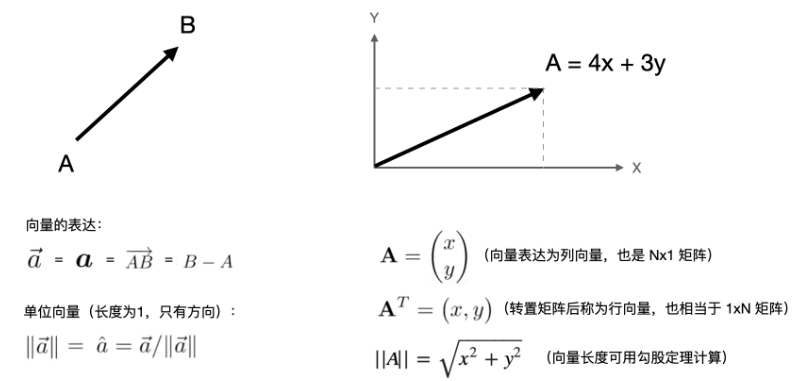

### 运算规则
| 运算 | 规则 | 图例 | 几何意义 | OpenGL应用 |
|-----|-----|-----|-----|-----|
| 向量加法（v + w）| 对应分量相加<br>2D：v.x+w.x, v.y+w.y<br>3D：v.x+w.x, v.y+w.y, v.z+w.z | 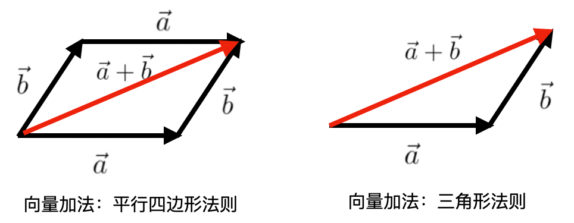 | 方向合成（平行四边形法则/三角形法则）| 位移叠加（如顶点位置 + 偏移向量：position + offset）<br>速度合成（如物体运动速度 + 风力速度）|
| 向量减法（v - w）| 对应分量相减<br>2D：v.x-w.x, v.y-w.y<br>3D：v.x-w.x, v.y-w.y, v.z-w.z | 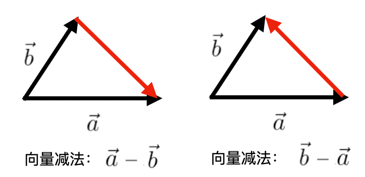 | 求两个点的方向差（v - w表示从w指向v的向量）| 计算视线方向（viewDir = cameraPos - vertexPos)<br>计算两点间距离（先求差向量，再求模长）|
| 标量乘法（k × v，k为标量）| 每个分量乘以标量 (k×v.x, k×v.y, ...) | 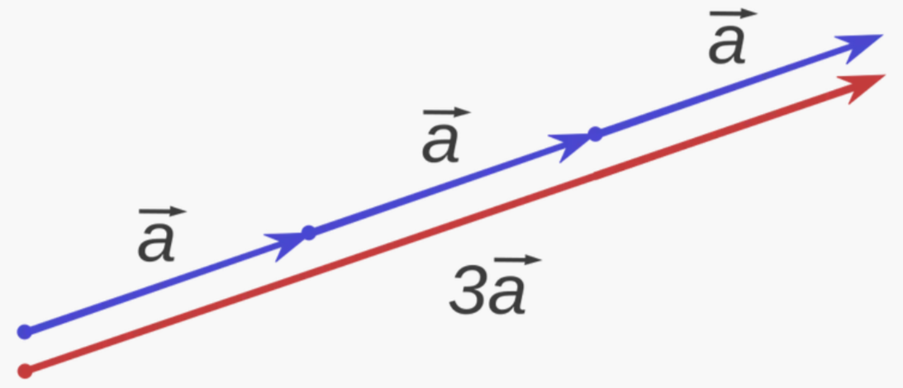 | 缩放向量模长（k>1 放大，0<k<1 缩小，k<0 反向）| 纹理坐标缩放（如uv × 2.0实现纹理重复）<br>方向向量调整（如光照方向lightDir × 0.5降低影响范围） |
| 向量点积（Dot Product，v · w）| 对应分量相乘后求和<br>2D：v.x×w.x + v.y×w.y<br>3D：v.x×w.x + v.y×w.y + v.z×w.z | 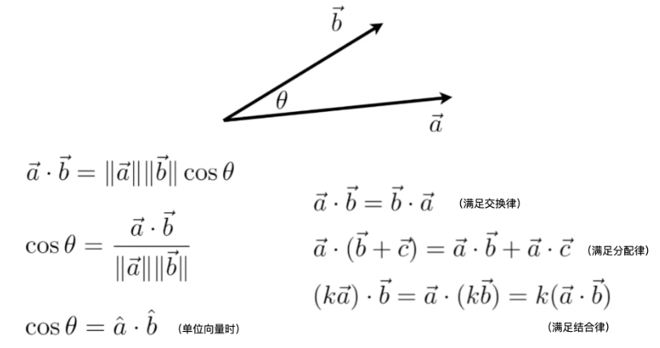 | 结果是标量，等于$ \|v\| \|w\| \cos\theta $（$\theta$ 是v和w的夹角）<br>核心用途：判断两个向量的「方向关系」（同向/反向/垂直）、计算投影 | 光照计算（Lambert漫反射：`diffuse = max(0, dot(normal, lightDir))`，法线与光照方向夹角越小，反射越强）<br>遮挡判断（点积为负表示向量反向，如背面剔除）<br>纹理采样梯度计算（如 dFdx(uv) 本质是向量点积）|
| 向量叉积（Cross Product，v × w）| 仅适用于3D向量，结果是一个新的3D向量，垂直于$v$和$w$所在平面：$v × w = (v.yw.z - v.zw.y,\ v.zw.x - v.xw.z,\ v.xw.y - v.yw.x)$ | 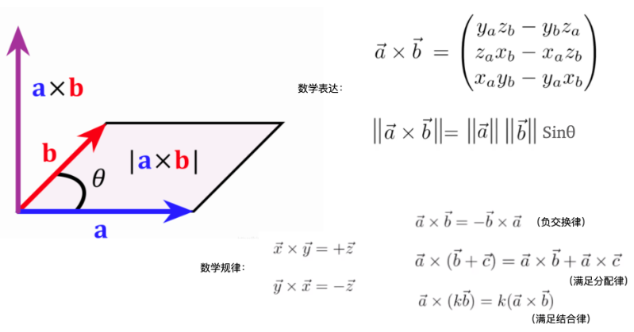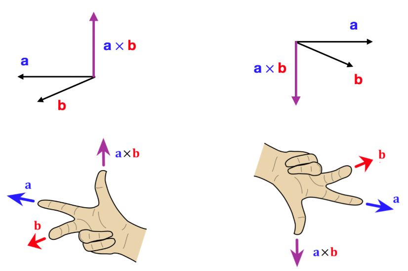 | 模长：$\|v × w\| = \|v\| × \|w\| × sinθ$（θ 是夹角，等于平行四边形面积）<br>方向：遵循右手定则（决定新向量的指向）| 计算法向量（如三角形的三个顶点坐标，通过叉积得到平面法线）<br>构建3D坐标系（如相机的右向量=上向量×视线方向）<br>判断点的位置（如判断点在三角形内部/外部）|
| 向量模长（Magnitude/Length）| 向量各分量平方和的平方根<br>2D：$√(v.x² + v.y²)$<br>3D：$√(v.x² + v.y² + v.z²)$ | 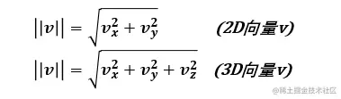 | 向量的「大小」（如位置向量的模长是到原点的距离）| 计算两点间距离 $distance = length(v - w)$<br>归一化向量 |
| 单位向量（Unit Vector）| 模长为1的向量，通过「归一化（Normalization）」得到<br>$unit_v = v / length(v)$（需确保 length(v) ≠ 0）| 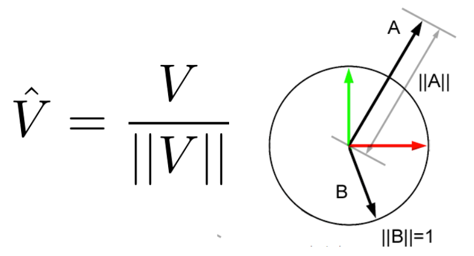 | 仅保留「方向」信息，消除大小影响（图形学中方向向量必须归一化，否则会导致计算错误）| 光照方向、视线方向、法向量必须归一化（如 `lightDir = normalize(lightPos - vertexPos)`）<br>纹理采样中的方向向量（如各向异性过滤中的梯度向量）|

### 向量在渲染管线中的应用
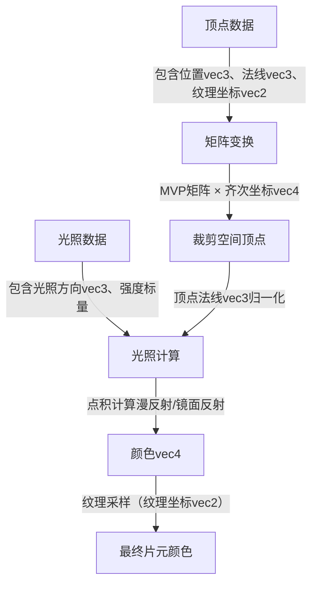

---

## 矩阵（Matrix）
### 数字定义
* **本质**：由m行×n列数值组成的矩形数组，记为 M[m×n]。
* **核心特征**：矩阵的维度决定了其能表示的变换类型（如2D变换用3x3矩阵，3D变换用4x4矩阵）；矩阵与向量的乘法是实现线性变换的核心手段。
* **图形学常用矩阵维度**：

| 矩阵类型 | 维度 | 几何意义 |
|------|------|------|
| 2D变换 | 3x3 | 2D顶点/纹理坐标的平移、旋转、缩放 |
| 3D变换 | 4x4 | 3D方向向量的旋转、缩放（无平移）|
| 3D齐次矩阵 | 4x4 | 3D点的平移、旋转、缩放（支持齐次坐标）|
| 投影矩阵 | 4x4 | 3D视图空间→裁剪空间的投影（透视 / 正交）|

### 行向量（Row Vector）& 列向量（Column Vector）
> OpenGL 默认采用列向量（Column Vector），传统 DirectX（D3D9 及更早）默认采用行向量（Row Vector）；现代 DirectX（D3D11+）支持灵活配置，但仍延续行向量的使用习惯

| 对比维度 | 列向量 | 行向量 |
|----|-----|----|
| 排布形式 | 按列排列的向量（如4D齐次列向量，w=1 表示点，w=0 表示方向 $v = \begin{bmatrix} x \\ y \\ z \\ w \end{bmatrix}$）| 按行排列的向量（如4D 齐次行向量，w=1 表示点，w=0 表示方向 $v = \begin{bmatrix} x & y & z & w \end{bmatrix}$）|
| 矩阵乘法位置 | 向量在矩阵右侧（$\vec{v}' = M \times \vec{v}$）| 向量在矩阵左侧（$\vec{v}' = \vec{v} \times M$）|
| 矩阵存储默认 | 列优先（Column-Major）| 行优先（Row-Major）|
| 多变换叠加 | 模型的缩放→旋转→平移变换，矩阵组合为：$M_{\text{总}} = M_{\text{平移}} \times M_{\text{旋转}} \times M_{\text{缩放}}$ | 模型的缩放→旋转→平移变换，矩阵组合为：$M_{\text{总}} = M_{\text{缩放}} \times M_{\text{旋转}} \times M_{\text{平移}}$ |
| MVP组合顺序 | 投影 × 视图 × 模 型（MVP= $M投影$ × $M视图$ × $M模型$<br>顶点变换流程：$\vec{v}_{\text{裁剪}} = M_{\text{投影}} \times M_{\text{视图}} \times M_{\text{模型}} \times \vec{v}_{\text{局部}}$ | 模型 × 视图 × 投影（MVP= $M模型$ × $M视图$ × $M投影$）<br> 顶点变换流程：$\vec{v}_{\text{裁剪}} = \vec{v}_{\text{局部}} \times M_{\text{模型}} \times M_{\text{视图}} \times M_{\text{投影}}$ |

### 运算规则
#### 单位矩阵（Identity Matrix）
* **定义**：主对角线元素为1，其余为0的矩阵（如4x4单位矩阵）：$I_{4×4} = \begin{bmatrix} 1 & 0 & 0 & 0 \\ 0 & 1 & 0 & 0 \\ 0 & 0 & 1 & 0 \\ 0 & 0 & 0 & 1 \end{bmatrix}$ <br><br>
* **性质**：任何矩阵与单位矩阵相乘，结果仍为原矩阵（如 $A \times I_{4×4} = A$）。
* **应用**：初始化变换矩阵（如先创建单位矩阵，再叠加平移/旋转/缩放）。

#### 矩阵×向量（核心：向量变换） 
* **规则**：仅当矩阵的列数= 向量的维度时可乘；结果是一个新向量，维度=矩阵的行数，示例（4x4矩阵 × 4D向量）：
    $
    \begin{bmatrix}
    m_{00} & m_{01} & m_{02} & m_{03} \\
    m_{10} & m_{11} & m_{12} & m_{13} \\
    m_{20} & m_{21} & m_{22} & m_{23} \\
    m_{30} & m_{31} & m_{32} & m_{33}
    \end{bmatrix}
    \times
    \begin{bmatrix} x \\ y \\ z \\ w \end{bmatrix}
    =
    \begin{bmatrix}
    m_{00}x + m_{01}y + m_{02}z + m_{03}w \\
    m_{10}x + m_{11}y + m_{12}z + m_{13}w \\
    m_{20}x + m_{21}y + m_{22}z + m_{23}w \\
    m_{30}x + m_{31}y + m_{32}z + m_{33}w
    \end{bmatrix}
    $
* **几何意义**：将输入向量按矩阵定义的规则变换为新向量（如平移、旋转、缩放）。<br><br>
  * 缩放（Scale）：将单位矩阵的每个对角线元素分别与向量对应的元素相乘。
    $
    \begin{bmatrix}
    S_1 & 0 & 0 & 0 \\
    0 & S_2 & 0 & 0 \\
    0 & 0 & S_3 & 0 \\
    0 & 0 & 0 & 1
    \end{bmatrix}
    \cdot
    \begin{bmatrix}
    x \\
    y \\
    z \\
    1
    \end{bmatrix}
    =
    \begin{bmatrix}
    S_1 \cdot x \\
    S_2 \cdot y \\
    S_3 \cdot z \\
    1
    \end{bmatrix}
    $
    <br><br>
  * 位移（Translation）：将单位矩阵的主对角线元素分别与向量对应的元素相加。
    $
    \begin{bmatrix}
    1 & 0 & 0 & T_1 \\
    0 & 1 & 0 & T_2 \\
    0 & 0 & 1 & T_3 \\
    0 & 0 & 0 & 1
    \end{bmatrix}
    \cdot
    \begin{bmatrix}
    x \\
    y \\
    z \\
    1
    \end{bmatrix}
    =
    \begin{bmatrix}
    x + T_1 \\
    y + T_2 \\
    z + T_3 \\
    1
    \end{bmatrix}
    $
    <br><br>
  * 旋转（Rotation）：
    * 沿X轴旋转：
      $
      \begin{bmatrix}
      1 & 0 & 0 & 0 \\
      0 & \cos\theta & -\sin\theta & 0 \\
      0 & \sin\theta & \cos\theta & 0 \\
      0 & 0 & 0 & 1
      \end{bmatrix}
      \cdot
      \begin{bmatrix}
      x \\
      y \\
      z \\
      1
      \end{bmatrix}
      =
      \begin{bmatrix}
      x \\
      \cos\theta \cdot y - \sin\theta \cdot z \\
      \sin\theta \cdot y + \cos\theta \cdot z \\
      1
      \end{bmatrix}
      $
      <br><br>
    * 沿Y轴旋转：
      $
      \begin{bmatrix}
      \cos\theta & 0 & \sin\theta & 0 \\
      0 & 1 & 0 & 0 \\
      -\sin\theta & 0 & \cos\theta & 0 \\
      0 & 0 & 0 & 1
      \end{bmatrix}
      \cdot
      \begin{bmatrix}
      x \\
      y \\
      z \\
      1
      \end{bmatrix}
      =
      \begin{bmatrix}
      \cos\theta \cdot x + \sin\theta \cdot z \\
      y \\
      -\sin\theta \cdot x + \cos\theta \cdot z \\
      1
      \end{bmatrix}
      $
      <br><br>
    * 沿Z轴旋转：
      $
      \begin{bmatrix}
      \cos\theta & -\sin\theta & 0 & 0 \\
      \sin\theta & \cos\theta & 0 & 0 \\
      0 & 0 & 1 & 0 \\
      0 & 0 & 0 & 1
      \end{bmatrix}
      \cdot
      \begin{bmatrix}
      x \\
      y \\
      z \\
      1
      \end{bmatrix}
      =
      \begin{bmatrix}
      \cos\theta \cdot x - \sin\theta \cdot y \\
      \sin\theta \cdot x + \cos\theta \cdot y \\
      z \\
      1
      \end{bmatrix}
      $ 
      <br><br>
    * 组合旋转：将多个旋转矩阵按顺序相乘，实现复合旋转（如 $R_{xyz} = R_{x} \times R_{y} \times R_{z}$）， 注意：旋转顺序对结果有影响（如 $R_{xyz}$ 与 $R_{zxy}$ 不同）。<br><br>
    * 任意轴旋转：[矩阵推导](https://en.wikipedia.org/wiki/Rotation_matrix#Rotation_matrix_from_axis_and_angle)，避免如先沿着X轴旋转再沿着Y轴旋转，导致[万向节死锁问题（Gimbal Lock）](https://www.youtube.com/watch?v=zc8b2Jo7mno)
      $
      \begin{bmatrix}
      \cos\theta + R_x^2(1 - \cos\theta) & R_x R_y (1 - \cos\theta) - R_z \sin\theta & R_x R_z (1 - \cos\theta) + R_y \sin\theta & 0 \\
      R_y R_x (1 - \cos\theta) + R_z \sin\theta & \cos\theta + R_y^2(1 - \cos\theta) & R_y R_z (1 - \cos\theta) - R_x \sin\theta & 0 \\
      R_z R_x (1 - \cos\theta) - R_y \sin\theta & R_z R_y (1 - \cos\theta) + R_x \sin\theta & \cos\theta + R_z^2(1 - \cos\theta) & 0 \\
      0 & 0 & 0 & 1
      \end{bmatrix}
      $

#### 矩阵×矩阵（核心：变换组合）
* **规则**：仅当第一个矩阵的列数 = 第二个矩阵的行数时可乘；结果矩阵的维度 = 第一个矩阵的行数 × 第二个矩阵的列数。
* **性质**：
  * 矩阵乘法不满足交换律：A×B ≠ B×A（顺序不同，结果不同）
  * 矩阵乘法满足结合律：(AB)C = A(BC)（变换顺序可任意分组）
  * 单位矩阵的左乘等于其自身：I×A = A（A 不变）
* **几何意义**：两个变换的叠加，顺序与矩阵乘法顺序相反（A×B × 向量表示先应用B变换，再应用A变换），如MVP矩阵组合（Projection × View × Model → 先应用Model变换，再View，最后Projection）。

#### 逆矩阵（Inverse Matrix）
* **定义**：若A×A⁻¹ = I（单位矩阵），则 A⁻¹是A的逆矩阵。<br><br>
  * 示例：2x2 矩阵的逆：
    $
    A = \begin{bmatrix} a & b \\ c & d \end{bmatrix}
    \implies A^{-1} = \frac{1}{ad - bc} \begin{bmatrix} d & -b \\ -c & a 
    \end{bmatrix}
    $      
    <br><br>
* **性质**：
  * 逆矩阵的逆等于原矩阵：A⁻¹⁻¹ = A（A 不变）。
  * 单位矩阵的逆等于其自身：I⁻¹ = I（I 不变）。
  * 矩阵乘逆矩阵等于单位矩阵：A⁻¹A = AA⁻¹ = I（A 不变）。
  * 矩阵乘法的逆等于其因子的逆按相反顺序相乘：（AB）⁻¹ = B⁻¹A⁻¹。
  * 矩阵逆的转置等于其转置的逆：(A⁻¹)ᵀ = (Aᵀ)⁻¹ （A 不变）。
* **几何意义**：逆矩阵对应逆变换（如 A 是旋转 90° 矩阵，A⁻¹ 是旋转 -90° 矩阵）。
* **应用**：视图矩阵（View Matrix）是相机变换的逆矩阵（相机移动 → 顶点反向移动）；法线矩阵是模型矩阵的逆转置矩阵。

#### 矩阵转置（Transpose Matrix）
* **定义**：将矩阵的行和列互换（$Mᵀ[i][j] = M[j][i]$），得到新矩阵（如 $A^T$）。<br><br>
  * 示例：2x2 矩阵的转置：
    $
    A = \begin{bmatrix} a & b \\ c & d \end{bmatrix}
    \implies A^T = \begin{bmatrix} a & c \\ b & d 
    \end{bmatrix}
    $
    <br><br>
* **性质**：
  * 转置矩阵的转置等于原矩阵：（Aᵀ）ᵀ = A。
  * 单位矩阵的转置等于其自身：Iᵀ = I。
  * 正交矩阵的转置等于其逆矩阵：A×Aᵀ = I。
  * 矩阵乘法的转置等于其因子的转置按相反顺序相乘：（AB）ᵀ = BᵀAᵀ。
* **几何意义**：将向量从行向量变换为列向量（或反之）。
* **应用**：法线矩阵（Normal Matrix）是模型矩阵的转置矩阵（用于处理法线向量的变换）。

---

## OpenGL 核心矩阵
### 模型矩阵（Model Matrix）
* **核心作用**：将顶点从局部空间（模型自身的坐标系统）转换到世界空间（场景全局坐标系统），包含模型的平移、旋转、缩放变换。
* **构建规则**：基于单位矩阵，按「缩放→旋转→平移」的顺序叠加变换（矩阵乘法顺序相反：Translate × Rotate × Scale × 单位矩阵）。
* **关键注意**：矩阵乘法顺序不可颠倒！若先平移再旋转，旋转中心会变成世界原点，而非模型中心。
```glsl
  #include <glm/glm.hpp>
  #include <glm/gtc/matrix_transform.hpp>
  
  // 初始化单位矩阵
  glm::mat4 model = glm::mat4(1.0f);
  
  // 1. 缩放（x/y/z 方向各缩放 0.5 倍）
  model = glm::scale(model, glm::vec3(0.5f, 0.5f, 0.5f));
  
  // 2. 旋转（绕 Y 轴旋转 45°，GLM 中角度需转换为弧度）
  model = glm::rotate(model, glm::radians(45.0f), glm::vec3(0.0f, 1.0f, 0.0f));
  
  // 3. 平移（沿 X 轴平移 1.0f，Y 轴 0.0f，Z 轴 -2.0f）
  model = glm::translate(model, glm::vec3(1.0f, 0.0f, -2.0f));
  
  // 最终 model 矩阵：先缩放 → 再旋转 → 最后平移
```

### 视图矩阵（View Matrix）
* **核心作用**：将顶点从世界空间转换到视图空间（相机的坐标系统），相当于移动相机或反向移动整个场景。
* **构建规则**：基于相机的位置（cameraPos）、目标点（cameraTarget）、上向量（cameraUp），GLM提供glm::lookAt函数直接构建。
* **几何意义**：视图矩阵 = 相机的平移逆矩阵 × 旋转逆矩阵，即让整个场景相对于相机反向运动（如相机向前移动2个单位 → 场景向后移动2个单位）。
```glsl
  // 相机参数
  glm::vec3 cameraPos = glm::vec3(0.0f, 0.0f, 3.0f);    // 相机位置（世界空间）
  glm::vec3 cameraTarget = glm::vec3(0.0f, 0.0f, 0.0f); // 相机看向的目标点
  glm::vec3 cameraUp = glm::vec3(0.0f, 1.0f, 0.0f);     // 相机上方向（默认 Y 轴）

  // 构建视图矩阵（本质是相机变换的逆矩阵）
  glm::mat4 view = glm::lookAt(cameraPos, cameraTarget, cameraUp);
```

### 投影矩阵（Projection Matrix）
* **核心作用**：将顶点从视图空间转换到裁剪空间，核心是实现透视投影（近大远小）或正交投影（无透视，用于2D/UI）。
* **关键注意**：
  * 透视投影的nearPlane 不能为0（否则会导致除法为0）；
  * 正交投影的left/right/bottom/top需与屏幕分辨率匹配，避免UI拉伸。

| 投影类型 | 核心特点 | 适用场景 | GLM 构建函数 | 
|----|----|----|----|
| 透视投影 | 近大远小 | 3D 场景 | glm::perspective(fovy, aspect, near, far) |
| 正交投影 | 无透视 | 2D/UI 场景 | glm::ortho(left, right, bottom, top, near, far) |
```glsl
  // 1. 透视投影矩阵（3D 场景）
  float fov = glm::radians(45.0f);       // 视场角（45°）
  float aspect = 800.0f / 600.0f;        // 屏幕宽高比（800x600）
  float nearPlane = 0.1f;                // 近裁剪面（必须 >0，避免与相机重叠）
  float farPlane = 100.0f;               // 远裁剪面（远景距离）
  glm::mat4 projection = glm::perspective(fov, aspect, nearPlane, farPlane);
  
  // 2. 正交投影矩阵（2D UI）
  float left = -400.0f;   // 左边界（屏幕宽度 800 → 从 -400 到 400）
  float right = 400.0f;
  float bottom = -300.0f; // 下边界（屏幕高度 600 → 从 -300 到 300）
  float top = 300.0f;
  glm::mat4 orthoProj = glm::ortho(left, right, bottom, top, nearPlane, farPlane);
```

### MVP 矩阵组合与顶点变换
* **核心作用**：将顶点从局部空间转换到屏幕空间（用于渲染），包含模型变换、视图变换、投影变换。
* **组合规则**：MVP = Projection × View × Model（矩阵乘法顺序：从右到左应用变换）。
* **顶点变换流程**：
  1. 局部空间顶点（vec3 pos）→ 齐次坐标（vec4(pos, 1.0f)，w=1表示点）；
  2. 乘以MVP矩阵：clipPos = MVP × vec4(pos, 1.0f)；
  3. 透视除法：ndcPos = clipPos / clipPos.w（将裁剪空间 → 归一化设备坐标，NDC范围[-1,1]×[-1,1]×[-1,1]）；
  4. 视口变换：OpenGL自动将NDC转换为屏幕空间坐标（基于 glViewport 设置的分辨率）。
* **GLSL顶点着色器实战**：
  ```glsl
  #version 330 core
  layout (location = 0) in vec3 aPos; // 局部空间顶点位置
  
  // 从 CPU 传入的 MVP 矩阵（uniform 表示全局变量）
  uniform mat4 mvp;
  
  void main() {
      // 核心：顶点变换（齐次坐标乘法）
      gl_Position = mvp * vec4(aPos, 1.0f);
  }
  ```

### 法线矩阵（Normal Matrix）
* **核心作用**：在光照计算中，将顶点法线从局部空间转换到视图空间，确保非均匀缩放时法线方向正确。
* **为什么需要？**：模型矩阵的缩放（尤其是非均匀缩放，如(2,1,1)）会导致法线方向失真，需通过逆转置矩阵修正。
* **公式推导**：设模型空间中表面切线为T，法线为N，相机/世界空间中： 表面切线为T′ 法线为N′。（T、T′可以有两个顶点相减所得）
  1. 模型空间中切线T与法线N垂直，即（用列向量的矩阵写法）：TᵀN=0。
  2. 空间变换：相机/世界空间中切线T′=MT、法线N′=GN，代入垂直条件得(MT)ᵀGN=0
  3. 矩阵展开：拆分转置后得到TᵀMᵀGN=0
  4. 推导关系：结合基础条件，要求MᵀG=I（单位矩阵）
  5. 结论：法线矩阵G=(M⁻¹)ᵀ
```glsl
  #version 330 core
  layout (location = 1) in vec3 aNormal; // 局部空间法线
  
  uniform mat4 model;
  uniform mat4 view;
  uniform mat3 normalMatrix; // 也可在 CPU 计算后传入，减少 GPU 开销
  
  void main() {
      // 方法 1：GPU 端计算法线矩阵（适合简单场景）
      mat3 modelViewMatrix = mat3(view * model);
      mat3 normalMatrix = transpose(inverse(modelViewMatrix));
      vec3 viewNormal = normalMatrix * aNormal;
  
      // 方法 2：CPU 端计算后传入（性能更优）
      // vec3 viewNormal = normalMatrix * aNormal;
  }
```

### TBN 矩阵
* **切线空间（Tangent Space）**：模型表面的局部坐标系，也叫纹理空间，其三个基向量就是 T（Tangent，切线）、B（Bitangent，副切线）、N（Normal，法线）。
  * N（法线）：模型表面的原始法线（顶点法线或高模烘焙的法线），指向表面外侧。
  * T（切线）：沿纹理U轴方向，与N垂直。
  * B（副切线）：沿纹理V轴方向，与T、N均垂直（由T和N叉乘得到）。
* **核心作用**：。法线贴图通过每个像素存储一个局部法线，能模拟微观凹凸，但这些法线是基于切线空间的，必须通过TBN矩阵转换到世界/视图空间，才能与光照方向正确计算。
* **数学定义**；是 3×3 正交矩阵（因为 T、B、N 是两两正交的单位向量）。
  * 列向量形式： T、B、N 作为矩阵的三列，得到切线空间 → 世界/视图空间的转换矩阵：
    $
    TBN = \begin{bmatrix}
          T.x & B.x & N.x \\
          T.y & B.y & N.y \\
          T.z & B.z & N.z \\
          \end{bmatrix}
    $
    <br>转换公式：$v_{目标空间}' = TBN \times v_{切线空间}'$（列向量右乘矩阵，符合OpenGL规则）。
    <br><br>
  * 行向量形式：将T、B、N作为矩阵的三行，得到世界/视图空间 → 切线空间的转换矩阵（本质是TBN矩阵的转置，因TBN是正交矩阵，转置 = 逆矩阵）：
    $
    TBN⁻¹ = TBNᵀ = \begin{bmatrix}
                   T.x & T.y & T.z \\
                   B.x & B.y & B.z \\
                   N.x & N.y & N.z \\
                   \end{bmatrix}
    $
    <br>转换公式：$v_{切线空间}' = (TBN)^{-1} \times v_{目标空间}'$（行向量左乘矩阵，与列向量右乘结果相反）。
    <br><br>
* **构建方法**：
  * **前置条件**：每个顶点必须包含三组数据（渲染引擎标准顶点格式）：
    * 位置 $\vec{p_o}$、$\vec{p_1}$、$\vec{p_2}$（三角形的三个顶点）。
    * 纹理坐标uv0、uv1、uv2（对应三个顶点的纹理坐标）。
    * 法线 $n'$（三角形的法线或顶点法线）。
* **构建步骤**：
  1. 计算三角形的边向量：$edge_1 = \vec{p_1} - \vec{p_o}$，$e_2 = \vec{p_2} - \vec{p_o}$。
  2. 纹理坐标差（U/V方向的差）：$Δuv_1 = (uv_1 - uv_0, uv_1 - uv_0)$、$Δuv_2 = (uv_2 - uv_0, uv_2 - uv_0)$。
  3. 计算切线T：切线T是边向量在纹理 U 轴方向的投影，公式推导基于纹理坐标与边向量的线性关系，通过纹理坐标差校正边向量，得到沿纹理U轴的切线，保证T与纹理方向一致。<br>
     核心公式：$invDenominator = \frac{1}{Δuv_1.x×Δuv_2.y−Δuv_1.y×Δuv_2.x} \vec{T} = \frac{invDenominator}{ (edge_1 \times Δuv_2.y−edge_2 \times Δuv_1.y)}$
  4. 计算副切线B：$\vec{B} = cross(\vec{T}, \vec{N})$ （可选但推荐：消除计算误差，确保 $\vec{T}$ 与 $\vec{N}$ 严格垂直：$\vec{T} = \vec{T} - dot(\vec{T}, \vec{N}) \times \vec{N}$ ）（注：叉乘顺序必须是 $\vec{T} × \vec{N}$，否则$\vec{B}$的方向会反向（遵循右手定则））。
  5. 正交归一化：$\vec{T} = normalize(\vec{T})$、$\vec{B} = normalize(\vec{B})$、$\vec{N} = normalize(\vec{N})$。
  6. 构建TBN矩阵：$TBN = \begin{bmatrix} T & B & N \end{bmatrix}$。
  ```c++ (GLM 端，CPU 预计算)
  #include <glm/glm.hpp>
  #include <glm/gtc/type_ptr.hpp>
  
  // 顶点数据结构体（渲染引擎标准格式）
  struct Vertex
  {
      glm::vec3 pos;    // 位置
      glm::vec2 uv;     // 纹理坐标
      glm::vec3 normal; // 法线
      glm::vec3 tangent;// 切线（输出）
      glm::vec3 bitangent;// 副切线（输出）
  };
  
  // 为单个三角形构建 TBN 矩阵
  void computeTBN(Vertex& v0, Vertex& v1, Vertex& v2)
  {
      // 步骤 1：计算边向量和纹理差
      glm::vec3 edge1 = v1.pos - v0.pos;
      glm::vec3 edge2 = v2.pos - v0.pos;
      glm::vec2 deltaUV1 = v1.uv - v0.uv;
      glm::vec2 deltaUV2 = v2.uv - v0.uv;
  
      // 步骤 2：计算切线 T
      float invDenominator = 1.0f / (deltaUV1.x * deltaUV2.y - deltaUV1.y * deltaUV2.x);
      glm::vec3 tangent = (edge1 * deltaUV2.y - edge2 * deltaUV1.y) * invDenominator;
  
      // 步骤 3：计算副切线 B
      glm::vec3 bitangent = glm::cross(tangent, v0.normal);
  
      // 步骤 4：正交化与归一化
      tangent = glm::normalize(tangent - glm::dot(tangent, v0.normal) * v0.normal);
      bitangent = glm::normalize(bitangent);
      v0.normal = glm::normalize(v0.normal);
  
      // 存储切线和副切线到顶点数据（所有顶点共享同一 TBN，也可插值到每个顶点）
      v0.tangent = tangent;
      v1.tangent = tangent;
      v2.tangent = tangent;
      v0.bitangent = bitangent;
      v1.bitangent = bitangent;
      v2.bitangent = bitangent;
  
      // 构建 TBN 矩阵（切线空间 → 世界空间）
      glm::mat3 TBN = glm::mat3(tangent, bitangent, v0.normal);
  }
  ```
  * **应用场景**：法线贴图 + TBN矩阵实现凹凸效果
    ```glsl
    #version 330 core
    in vec2 uv;
    in mat3 TBN;
    in vec3 fragPosView;
  
    uniform sampler2D normalMap; // 法线贴图（RGB 存储切线空间法线）
    uniform vec3 lightDirView;   // 视图空间光照方向（已归一化）
    uniform vec3 viewDirView;    // 视图空间视线方向（已归一化）
  
    out vec4 fragColor;
  
    void main() {
        // 1. 解码法线贴图（法线贴图存储范围 [0,1]，转换为 [-1,1]）
        vec3 tangentNormal = texture(normalMap, uv).rgb;
        tangentNormal = normalize(tangentNormal * 2.0 - 1.0); // 转为单位向量
  
        // 2. 切线空间法线 → 视图空间法线（核心：TBN 矩阵转换）
        vec3 normalView = normalize(TBN * tangentNormal);
  
        // 3. 光照计算（你学过的漫反射公式）
        float diffuse = max(dot(normalView, lightDirView), 0.0);
        vec3 diffuseColor = vec3(0.8, 0.5, 0.3) * diffuse;
  
        // 4. 镜面反射（可选，PBR 基础）
        vec3 reflectDir = reflect(-lightDirView, normalView);
        float specular = pow(max(dot(viewDirView, reflectDir), 0.0), 32.0);
        vec3 specularColor = vec3(1.0) * specular;
  
        // 5. 最终颜色
        fragColor = vec4(diffuseColor + specularColor, 1.0);
    }
    ```
  
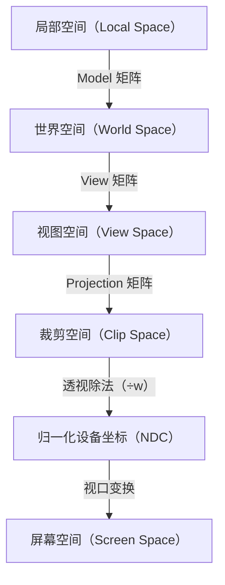

---
