# Mipmap
> Mipmap（多级渐远纹理）：针对纹理采样走样（Aliasing）设计的核心优化技术，本质是为纹理预生成一系列 “逐级缩小的金字塔形纹理层级”，采样时GPU会根据纹理在屏幕上的显示尺寸，自动选择匹配的Mip层级。既消除远距纹理的锯齿/闪烁，又提升采样性能。

<!-- TOC -->
* [Mipmap](#mipmap)
  * [纹素（Texel）&像素（Pixel）](#纹素texel像素pixel)
  * [四元光栅化（Quadratic Rasterization）](#四元光栅化quadratic-rasterization)
  * [GLSL 偏导函数](#glsl-偏导函数)
  * [解决的问题](#解决的问题)
  * [实现原理](#实现原理)
    * [层级结构](#层级结构)
    * [层级生成原理](#层级生成原理)
  * [过滤方式](#过滤方式)
    * [基础过滤方式（OpenGL 原生支持，核心组合型）](#基础过滤方式opengl-原生支持核心组合型)
    * [扩展增强型过滤（基于基础过滤的优化，解决视角/拉伸问题）](#扩展增强型过滤基于基础过滤的优化解决视角拉伸问题)
    * [自定义控制过滤算法（手动干预 LOD/梯度）](#自定义控制过滤算法手动干预-lod梯度)
    * [各算法关键维度对比](#各算法关键维度对比)
  * [性能优化（结合OpenGL场景）](#性能优化结合opengl场景)
<!-- TOC -->

---

## 纹素（Texel）&像素（Pixel）
* **定义**：
  * 纹素（Texel）是纹理图像的基本采样单元，每个纹素对应一个颜色值。
  * 像素（Pixel）是屏幕上的最小显示单元，每个像素对应一个颜色值。
  * 纹理映射（Texture Mapping）将纹素映射到屏幕上的像素，实现纹理渲染。
* **差异**：

  | 对比维度 | 纹素（Texel）| 像素（Pixel）|
  |----|----|----|
  | 核心作用 | 存储纹理的颜色/数据信息（如贴图的颜色、法线、粗糙度等）| 呈现最终渲染结果（将帧缓冲中的颜色值转换为屏幕可见的光/色）|
  | 尺寸特性 | 尺寸固定（由纹理分辨率决定，如 512x512 纹理的纹素尺寸是 “纹理宽高的1/512”） | 尺寸固定（由显示器分辨率决定，如 1920x1080 屏幕的像素尺寸是 “屏幕宽高的 1/1920”）|
  | 数量决定因素 | 由纹理分辨率决定（如 1024x1024 纹理有 1024×1024=1,048,576个纹素） | 由显示器/帧缓冲分辨率决定（如 1920x1080 屏幕有 1920×1080≈200 万个像素） |
  | 数据内容 | 可存储多种信息（颜色 RGB、法线向量、材质参数等）| 通常仅存储最终渲染的颜色值（RGBA）|
  | 生命周期 | 与纹理资源绑定（纹理销毁则纹素数据释放）| 与帧缓冲/显示器绑定(帧缓冲刷新则像素内容更新）|

* **联系**：
  * 通过纹理映射（Texture Mapping）将纹素映射到屏幕上的像素，实现纹理渲染。但两者的数量/尺寸通常不匹配，因此需要 “过滤（Filtering）” 技术：
    * 纹理放大（纹素少、像素多）当纹理尺寸 < 渲染区域尺寸（如256x256纹理贴到512x512的模型上），1个纹素对应多个像素。GPU通过 “放大过滤”（如GL_LINEAR）对纹素进行插值，生成像素的颜色值。
    * 纹理缩小（纹素多、像素少）：当纹理尺寸 > 渲染区域尺寸（如1024x1024纹理贴到256x256的模型上），多个纹素对应1个像素。GPU通过 “Mipmap+缩小过滤”（如 GL_LINEAR_MIPMAP_LINEAR）选择匹配的Mip层级纹素，再插值生成像素颜色，避免锯齿。
    * 一对一匹配（理想情况）：当纹理分辨率与渲染区域分辨率完全一致时，1个纹素直接对应1个像素，此时无需复杂过滤，仅做直接采样。

---

## 四元光栅化（Quadratic Rasterization）
* **定义**： GPU在处理FragmentShader的时候,并不是每个片元单独处理,而是打成一个2*2的区块进行处理，本质是 “批量并行 + 数据共享”。
* **关键特性**：
  * **区块是最小并行单元**：一个2x2区块包含4个相邻片元，GPU用SIMD（单指令多数据）指令同时处理这4个片元，大幅提升并行效率；
  * **区块内信息共享**：区块内的片元共享纹理坐标、深度值等公共数据，避免重复计算；
  * **边界填充处理**：屏幕边缘、三角形边缘等无法形成完整2x2区块的区域，GPU会填充“无效片元”（Inactive Fragment），执行后丢弃其结果，不影响最终渲染。
* **关键步骤**：
  1. **片元分组**：光栅化生成的片元按屏幕坐标（x,y）连续分组，例如 (0,0)、(0,1)、(1,0)、(1,1) 组成一个区块，(1,1)、(1,2)、(2,1)、(2,2) 组成下一个区块。
  2. **边界填充**：若区块包含屏幕外或三角形外的片元（如屏幕角落的区块只有1个有效片元），GPU会添加无效片元，确保区块是2x2大小，无效片元的着色器执行结果会被忽略。
  3. **预处理（梯度计算）**：GPU 提前计算区块内片元的纹理坐标（UV）、深度值等参数的 梯度（导数），供纹理采样（Mipmap层级选择）、几何函数（如dFdx）使用。
  4. **SIMD并行执行**：片元着色器的指令（如颜色计算、纹理采样）会同时应用到4个片元上，硬件层面的SIMD指令让4个片元共享同一套指令流，仅数据不同，提升执行效率。
  5. **批量测试**：对整个区块执行EarlyZ（深度测试）、AlphaTest（透明度测试），若区块内所有片元都被剔除，则直接丢弃整个区块，避免后续无效操作。
* **核心设计优势**：
  * **支持导数计算（图形学核心需求）**：片元着色器中的 导数函数（dFdx、dFdy、fwidth）和 纹理采样的梯度计算（Mipmap层级选择、各向异性过滤），必须依赖相邻片元的参数差值——2x2区块刚好能提供足够的相邻数据。
  * **提升SIMD并行效率**：GPU核心是SIMD架构（单指令多数据），即一条指令可以同时处理多个数据。2x2区块的4个片元刚好匹配SIMD指令的 “向量宽度”（很多GPU的SIMD宽度为 4），能最大化指令利用率。
  * **优化EarlyZ/AlphaTest 性能**：EarlyZ是 “在片元着色器执行前进行深度测试” 的优化，目的是剔除被遮挡的片元，避免无效的着色器执行2x2区块批量处理时：GPU可一次性测试整个区块的深度值，
    若所有片元都被遮挡，直接跳过整个区块的着色器执行，比逐个测试效率高4倍，即使部分片元被遮挡，批量测试也能减少硬件调度开销。
  * **减少内存带宽占用**：2x2区块内的片元共享部分数据（如纹理采样的Mipmap 层级、梯度值），GPU只需计算一次并复用，无需每个片元单独计算，减少了数据读取和存储的带宽开销。
* **应用**：
  * **纹理映射（Texture Mapping）**：在纹理映射过程中，需要对纹理坐标进行插值，以实现纹理采样的正确映射。
  * **阴影映射（Shadow Mapping）**：在阴影映射过程中，需要对阴影坐标进行插值，以实现阴影采样的正确映射。
  * **性能优化**：
    * **减少discard的使用**：discard会破坏2x2区块的完整性，导致后续片元的导数计算和批量测试失效，尽量用Alpha Blend替代AlphaTest（若业务允许）。
    * **复用梯度计算**：若多次采样同一纹理，可手动计算一次梯度并复用，避免硬件重复计算。
    ```glsl
    vec2 dx = dFdx(uv);
    vec2 dy = dFdy(uv);
    vec4 color1 = textureGrad(tex, uv, dx, dy); // 手动传入梯度
    vec4 color2 = textureGrad(tex, uv + offset, dx, dy);
    ```
  * **避免在片元着色器中修改深度值**：修改深度值（gl_FragDepth）会禁用EarlyZ优化，且2x2区块的批量深度测试失效，性能大幅下降。

    ```mermaid
    graph TD
    A[光栅化阶段] -->|生成片元（包含位置、UV、深度等）| B[片元分组:按 2x2 区块打包]
    B -->|填充边缘无效片元| C[区块信息预处理:计算共享数据（如纹理坐标梯度、深度值等）]
    C --> D[批量执行片元着色器:SIMD 并行处理 4 个片元]
    D --> E[批量测试:Early Z/Alpha Test（剔除无效片元）]
    E --> F[合并结果:仅保留有效片元的颜色/深度值]
    F --> G[输出到帧缓冲（Framebuffer）]
    ```
---

## GLSL 偏导函数
* **定义**： 偏导（Partial Derivative）：函数在某一点沿某个方向的变化率。
* **语法**：
  * `dF/dx`：函数 `F` 在点 `(x,y)` 沿 `x` 方向的偏导数。
  * `dF/dy`：函数 `F` 在点 `(x,y)` 沿 `y` 方向的偏导数。
* **纹理采样函数梯度计算**：
  * **隐式计算梯度**：默认的纹理采样函数（不带Lod/Grad后缀）会自动隐式计算梯度，例如： `texture(tex, uv)（GLSL 130+）`、`texture2D(tex, uv)（旧版 GLSL）`、`textureCube(tex, dir)`。
  * **手动控制 Mip 层级或梯度的采样函数**：例如 `textureLod(tex, uv, lod)`、`textureGrad(tex, uv, dx, dy)` 、`textureProjLod/textureCubeLod` 等，不会隐式计算梯度。
  * **使用限制**：
    * **先计算导数，再执行discard**： 只能在2x2区块内有效：若片元被discard或处于区块边缘的无效片元，导数计算会失效（导致纹理模糊或锯齿）。
      ```glsl
      // 正确示例：导数计算在 discard 前
      float gradient = dFdx(uv.x);
      if (texture(a, uv).a < 0.5) discard;
  
      // 错误示例：discard 后调用 dFdx，可能导致梯度异常
      if (texture(a, uv).a < 0.5) discard;
      float gradient = dFdx(uv.x); // 风险：被 discard 的片元破坏了 2x2 区块完整性
      ```
    * 避免在片元着色器中使用 “相邻片元的输出”（如试图读取右边片元的颜色），硬件不支持这种跨片元访问，且会破坏批量处理逻辑。
* **应用**：
  * Mipmap：纹理映射（Texture Mapping）中，用于计算纹理坐标的变化率，从而实现纹理采样的正确映射。

---

## 解决的问题
* **纹理走样（Aliasing）** ：
  * 远距物体的纹理像素（Texel）远小于屏幕像素（Pixel），GPU需采样大量Texel拟合一个Pixel，导致纹理闪烁、锯齿（点采样）或模糊（过度插值）；
  * 斜视角下纹理拉伸，出现 “摩尔纹”。

  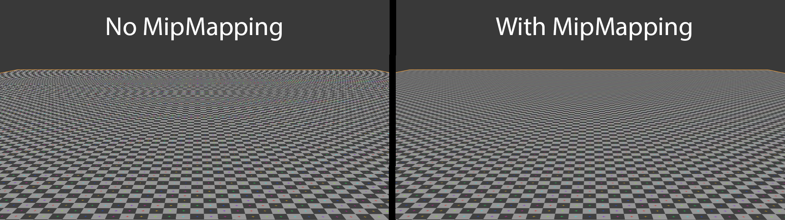
  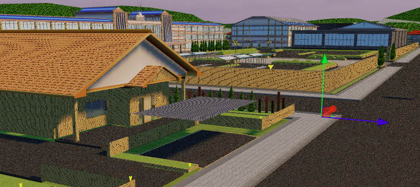
* **性能损耗**：采样远距纹理时，GPU需读取原始大尺寸纹理的大量数据，带宽占用高，效率低。

---

## 实现原理
### 层级结构
* **二分向下采样（DownSampling）**：对原始纹理图像进行递归二分缩小，生成Mipmap层级,每个层级都是前一个层级的一半尺寸（如 1024x1024 -> 512x512 -> 256x256 -> ...）。
* **层级数量**：N*M纹理的Mipmap层级数量为 `log2(max(N,M)) + 1` （如 1024x1024 纹理有11个层级，Level0 ~ Level10）。

  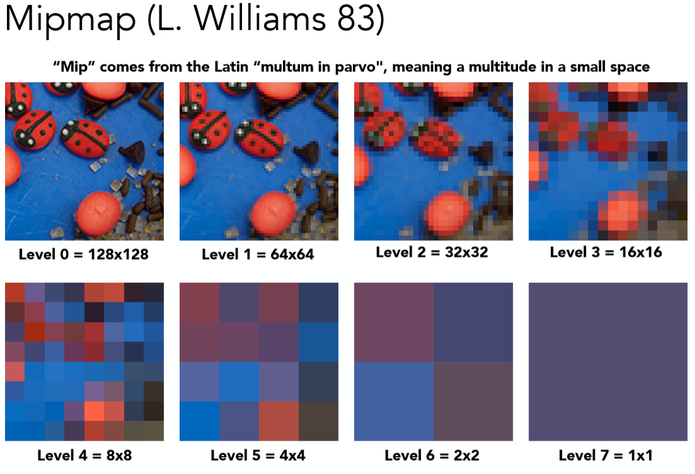
  
### 层级生成原理
* **滤波**：对图像进行模糊处理
  * 均值滤波（Mean Filter）：对每个像素的周围N*N个像素取平均值，生成新的像素值。 
    * 权重计算：`f(x,y) = (1 / (N * N)) * Σ Σ f(x+i,y+j)`，其中 `(i,j)` 是像素 `(x,y)` 周围的偏移量。
  * 高斯滤波（Gaussian Filter）：对每个像素的周围N*N个像素进行加权平均，权重根据距离高斯分布。
    * 权重计算：`w(i,j) = exp(-(i^2 + j^2) / (2 * σ^2))`，其中 `(i,j)` 是像素 `(x,y)` 周围的偏移量，`σ` 是高斯分布的标准差。
      
  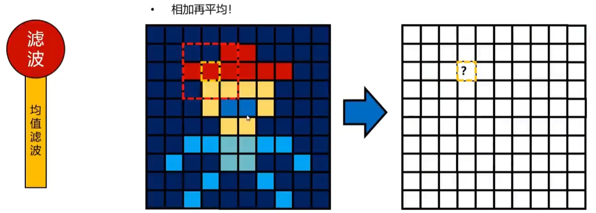
  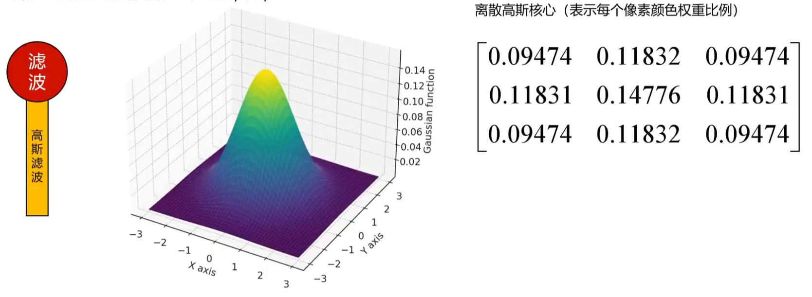
  
* **采样**：对模糊后的图像进行采样，生成下一级Mip层级的纹素。
  
  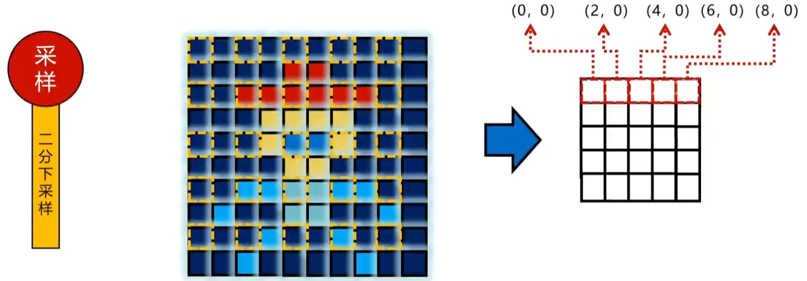
  
* **判断Mipmap层级**：
  * **纹素对应Mipmap层级**：若纹素坐标为 `(x,y)`，则对应Mipmap层级L为 `D =max(sqrt(max(dot(dx,dx), dot(dy,dy)))) ,  L = log2(D)`（四舍五入取整数部分）。

  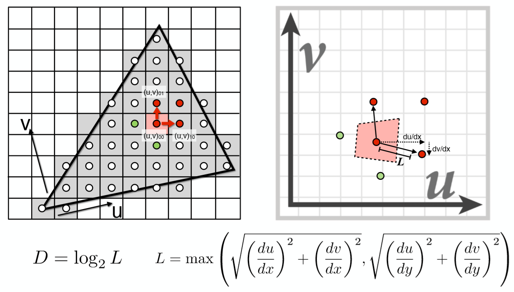
    
  ```glsl
  // 1. 获取当前物体像素对应纹理上的纹素的具体坐标
  vec2 location = uv * vec2(textureWidth, textureHeight);
  // 2. 计算当前像素对应纹素具体坐标相对X与Y方向的变化量
  vec2 dx = dFdx(location);
  vec2 dy = dFdy(location);
  // 计算对应Mipmap层级
  float maxDelta = sqrt(max(dot(dx,dx), dot(dy,dy))); // 点乘后开方：考虑纹理歪斜（非等比缩放、旋转）情况 ，取最大变化量作为Mipmap层级
  float L = log2(maxDelta);
  int level = max(int(L + 0.5), 0); // 大于xx.5, 取下一个层级
  FragColor = textureLod(texture, uv, level);

  /* 计算对应Mipmap层级
   * maxDelta: 当前像素对应（M*N）纹素，取得最大值
   * maxDelta < 1,L < 0; 图片放大了, Mipmap层级为0
   * 1 < maxDelta < 2, 0 < L < 1; L数值小于0.5，Mipmap层级为0, L数值大于等于0.5，Mipmap层级为1
   * maxDelta = 2，L = 1，一个像素对应2个纹素， Mipmap层级为1
   * 2 < maxDelta < 4, 1 < L < 2; L数值小于1.5，Mipmap层级为1, L数值大于等于1.5，Mipmap层级为2
   * maxDelta = 4，L = 2，一个像素对应4个纹素， Mipmap层级为2
   * 4 < maxDelta < 8, 2 < L < 3; L数值小于2.5，Mipmap层级为2, L数值大于等于2.5，Mipmap层级为3
   * maxDelta = 8，L = 3，一个像素对应8个纹素， Mipmap层级为3
  */
    
  ```

---

## 过滤方式
### 基础过滤方式（OpenGL 原生支持，核心组合型）
> 这类算法对应 GL_TEXTURE_MIN_FILTER 参数（仅作用于纹理缩小场景），是所有 Mipmap 过滤的基础，核心解决 “远距纹理走样”，但均假设纹理采样 “各向同性”（U/V方向梯度一致）。
* **最近邻Mipmap最近邻（GL_NEAREST_MIPMAP_NEAREST）**
  * **原理**：先选择与纹理坐标梯度计算的 LOD最接近的整数Mip层级，再在该层级内对纹素做最近邻采样（取距离UV坐标最近的1个纹素）。
  * **算法**：
    1. 计算纹理坐标梯度与LOD：$(\text{LOD} = 0.5 \times \log_2\left( \max\left( (G_x)^2, (G_y)^2 \right) \right));（(G_x = \frac{\partial UV_x}{\partial x} \cdot W_0)，(G_y = \frac{\partial UV_y}{\partial y} \cdot H_0)，(W_0/H_0)$ 为 Level 0 纹理宽/高
    2. 选择最近整数层级：$(L' = \text{round}(\text{LOD}))$（四舍五入）
    3. 缩放UV至 Level $(L')$ 坐标空间：$(UV' = UV \times 2^{L'})$；
    4. 最近邻采样：$(\text{Color} = \text{tex}_{L'}\left( \lfloor UV'.x \rfloor, \lfloor UV'.y \rfloor \right))$。
* **线性Mipmap最近邻（GL_LINEAR_MIPMAP_NEAREST）**
  * **原理**：选择与LOD最接近的整数Mip层级，再在该层级内对UV周围4个纹素做双线性插值（加权混合）。
  * **算法**：
    1. 计算LOD并选择整数层级$(L')$(同 “最近邻 Mipmap 最近邻” 步骤1-2)。
    2. 缩放UV至 Level $(L')$ 坐标空间：$(UV' = UV \times 2^{L'})$。
    3. 拆分UV'为整数/小数部分：$UV' = (i + u, j + v))(i=\lfloor UV'.x \rfloor, j=\lfloor UV'.y \rfloor, u=UV'.x-i, v=UV'.y-j)$。
    4. 双线性插值：$\text{Color} = (1-u)(1-v)\cdot\text{tex}_{L'}(i,j) + u(1-v)\cdot\text{tex}_{L'}(i+1,j) + (1-u)v\cdot\text{tex}_{L'}(i,j+1) + uv\cdot\text{tex}_{L'}(i+1,j+1))$。
* **最近邻Mipmap线性（GL_NEAREST_MIPMAP_LINEAR）**
  * **原理**：选择LOD相邻的两个整数Mip层级$L = (\lfloor \text{LOD} \rfloor)，(L+1)$，先在每个层级内做最近邻采样，再对两个层级的结果做线性插值。
  * **算法**：
    1. 计算LOD并拆分：$L = \lfloor \text{LOD} \rfloor，f = \text{LOD} - L$（$f$为层级间插值权重）。
    2. Level$L$最近邻采样：$\text{Color}_L = \text{tex}_L\left( \lfloor UV \times 2^L.x \rfloor, \lfloor UV \times 2^L.y \rfloor \right)$。
    3. Level$L+1$最近邻采样：$text{Color}_{L+1} = \text{tex}_{L+1}\left( \lfloor UV \times 2^{L+1}.x \rfloor, \lfloor UV \times 2^{L+1}.y \rfloor \right)$
    4. 层级间线性插值：$text{FinalColor} = (1-f) \cdot \text{Color}_L + f \cdot \text{Color}_{L+1}$。
* **线性 Mipmap 线性（GL_LINEAR_MIPMAP_LINEAR，三线性插值）**
  * **原理**：选择LOD相邻的两个整数Mip层级，先在每个层级内做双线性插值，再对两个层级的结果做线性插值（覆盖U/V/LOD三个维度，故名 “三线性”）。
  * **算法**：
    1. 计算LOD并拆分：$L = \lfloor \text{LOD} \rfloor，f = \text{LOD} - L$（$f$为层级间插值权重）。
    2. Level $L$双线性插值：$\text{Color}_L = (1-u)(1-v)\cdot\text{tex}_{L}(i,j) + u(1-v)\cdot\text{tex}_{L}(i+1,j) + (1-u)v\cdot\text{tex}_{L}(i,j+1) + uv\cdot\text{tex}_{L}(i+1,j+1))$。
    3. Level $L+1$双线性插值：$\text{Color}_{L+1} = (1-u)(1-v)\cdot\text{tex}_{L+1}(i,j) + u(1-v)\cdot\text{tex}_{L+1}(i+1,j) + (1-u)v\cdot\text{tex}_{L+1}(i,j+1) + uv\cdot\text{tex}_{L+1}(i+1,j+1))$。
    4. 层级间线性插值：$\text{FinalColor} = (1-f) \cdot \text{Color}_L + f \cdot \text{Color}_{L+1}$。
    
  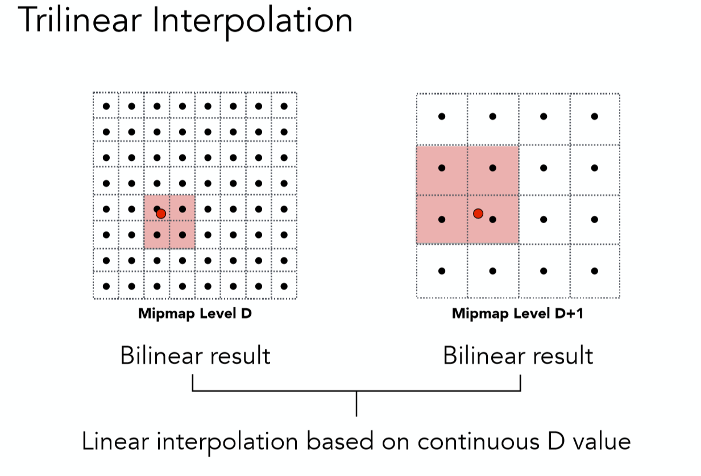
  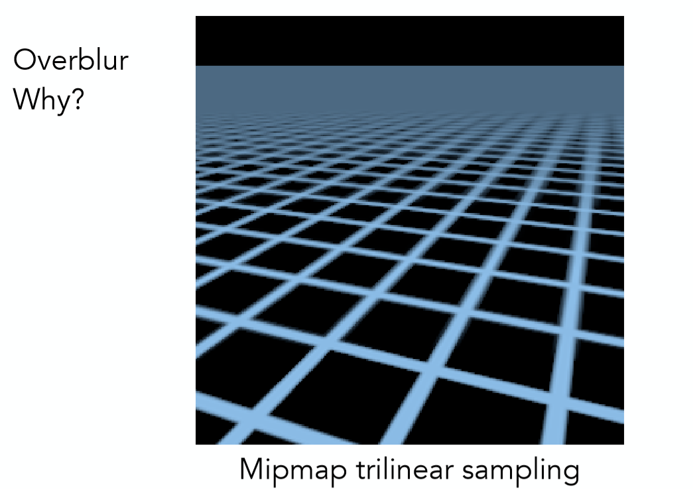
    
### 扩展增强型过滤（基于基础过滤的优化，解决视角/拉伸问题）
> 基础算法假设 “各向同性”（U/V 梯度一致），但斜视角下纹理拉伸导致采样不足，进阶算法通过优化采样核形状、增加采样点解决该问题。
* **各向异性过滤（Anisotropic Filtering, AF）**
  * **原理**：打破“各向同性假设”，计算U/V方向梯度的比值（各向异性因子$r$），将采样核从 “正方形” 改为 “椭圆”，沿拉伸方向增加采样点，再对所有采样点的三线性插值结果做高斯加权混合。
  * **算法**：
    1. 计算纹理梯度与各向异性因子：$r = \frac{\max(|G_x|, |G_y|)}{\min(|G_x|, |G_y|)}, \quad r_{\text{clamped}} = \min(r, \text{AF等级}))$(如4x AF则$r_{\text{clamped}} ≤4)$。
    2. 确定椭圆采样核：长轴 = 短轴 $r_{\text{clamped}}$（长轴沿梯度更大的方向）。
    3. 生成采样点：沿长轴生成$N$个等距采样点(N=AF 等级)。
    4. 每个采样点三线性插值：得到$\text{Color}_i$。
    5. 高斯加权混合：$\text{FinalColor} = \frac{\sum_{i=1}^N w_i \cdot \text{Color}_i}{\sum_{i=1}^N w_i} (w_i = e^{-k \cdot d_i^2}，d_i$为采样点到UV的距离）。

  <div style="display: flex; justify-content: flex-start; align-items: center; gap: 10px;">
    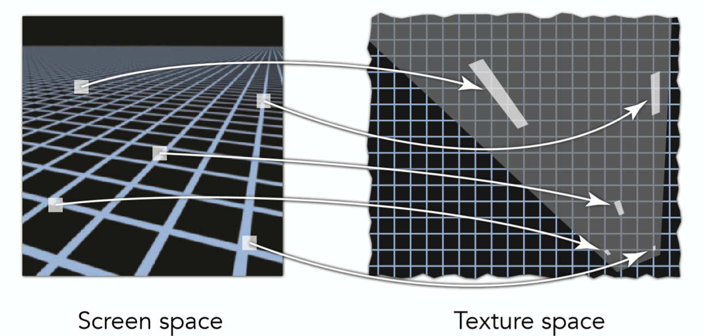
    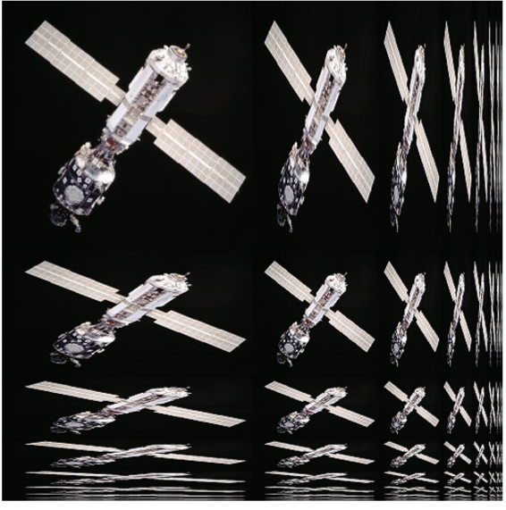
    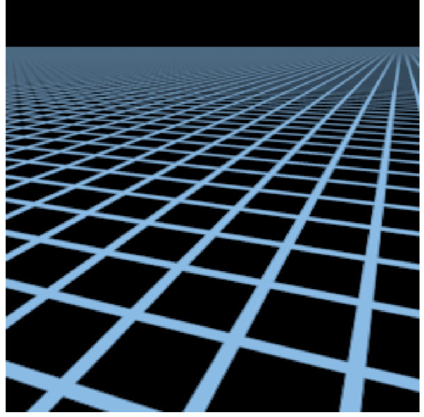
  </div>

* **EWA 过滤（Elliptical Weighted Average）**
  * **原理**：AF的高精度变体，将采样权重视为 “椭圆高斯分布”，覆盖椭圆采样核内所有纹素（而非离散采样点），加权平均后得到最终颜色。
  * **算法**：
    1. 计算椭圆采样核的高斯权重函数：$w(u,v) = e^{-\frac{1}{2} \left( \frac{u^2}{\sigma_u^2} + \frac{v^2}{\sigma_v^2} \right)}) (\sigma_u/\sigma_v)$由各向异性因子决定）
    2. 遍历椭圆内所有纹素$(i,j)$，计算每个纹素的权重$w(i,j)$
    3. 加权混合所有纹素颜色：$text{FinalColor} = \frac{\sum_{i,j \in \text{椭圆}} w(i,j) \cdot \text{tex}(i,j)}{\sum_{i,j \in \text{椭圆}} w(i,j)}$。
* **压缩纹理适配过滤**
  * **原理**：针对DXT/BCn/ETC等压缩纹理优化：压缩纹理按4x4块存储，过滤时先对 “压缩块” 做插值，再解压缩，减少显存带宽开销。。
  * **算法**：
    1. 按压缩块拆分纹理坐标：将UV映射到4x4压缩块的坐标空间）。
    2. 压缩块内插值：对相邻压缩块的 “颜色码/索引” 做双线性插值。
    3. 解压缩：将插值后的压缩数据解压缩为纹素颜色。
    4. 执行基础过滤（三线性/AF）：同非压缩纹理流程。

### 自定义控制过滤算法（手动干预 LOD/梯度）
> 开发者绕过 GPU 自动计算，手动控制 LOD 或梯度，适配特殊场景（如 UI、批量采样）。
* **手动 LOD 过滤（textureLod/textureCubeLod）**
  * **原理**：手动指定Mip层级，绕过GPU自动LOD计算，层级内默认执行双线性插值。
  * **算法**：
    ```glsl
    // 强制使用 Mip Level 0（原始纹理，无缩小模糊）
    vec4 uiColor = textureLod(uiTex, uv, 0.0);
    // 手动指定 LOD=2，适配固定距离的模型纹理
    vec4 modelColor = textureLod(modelTex, uv, 2.0);
    ```
* **手动梯度过滤（textureGrad/textureCubeGrad）**
  * **原理**：手动传入纹理坐标的梯度（dFdx/dFdy 结果），替代GPU自动计算的梯度，精准控制LOD选择。
  * **算法**：
    ```glsl
    // 手动计算梯度，复用给多次采样
    vec2 dx = dFdx(uv);
    vec2 dy = dFdy(uv);
    // 两次采样复用同一梯度，避免 GPU 重复计算
    vec4 color1 = textureGrad(tex, uv, dx, dy);
    vec4 color2 = textureGrad(tex, uv + offset, dx, dy);
    ```

### 各算法关键维度对比
| 算法类型	 | 核心解决问题 | 核心缺陷 | 性能等级 | 质量等级 | 典型适用场景 |
|----|----|----|----|----|----|
| 最近邻Mipmap最近邻 | 极致性能 | 块状感、层级断层 | 最优 | 最差 | 像素游戏、低端硬件 |
| 线性Mipmap最近邻 | 层级内平滑 | 层级断层、各向异性模糊 | 中 | 较好 | 静态场景、中端硬件 |
| 最近邻Mipmap线性 | 层级内平滑 | 层级内块状感 | 中 | 中等 | 远处地形、低精度模型 |
| 线性Mipmap线性 | 全维度平滑 | 各向异性模糊 | 中-低 | 优 | 通用3D场景、游戏 |
| 各向异性过滤（AF） | 斜视角拉伸模糊 | 带宽开销、高等级性能损耗 | 中-低 | 最优 | 3D游戏、开放世界 |
| EWA过滤 | 高精度无失真采样 | 实时性能极低 | 最差 | 顶级 | 离线渲染、高端3A游戏 |
| 压缩纹理适配过滤 | 压缩纹理显存开销 | 压缩块边界轻微失真 | 中 | 优 | 移动端、显存受限设备 |
| 手动LOD过滤 | 精准控制层级 | 开发成本高、无自适应 | 中 | 优 | UI纹理、特效纹理 |
| 手动梯度过滤 | 修复梯度失效 | 梯度计算易出错 | 中 | 优 | 批量采样、Alpha测试后采样 |

---

## 性能优化（结合OpenGL场景）
* **纹理尺寸优先用2的幂次**：现代OpenGL（核心模式）支持非2的幂次，但性能/兼容性差，为了利用硬件的优化，建议使用2的幂次作为纹理尺寸（如 256x256、512x512、1024x1024等）。
* **静态纹理必用Mipmap**：静态纹理（如场景贴图、模型纹理、天空盒）在场景中不频繁变化，建议开启Mipmap，生成Mipmap后设为三线性过滤+各向异性过滤。
* **动态纹理慎选Mipmap**：动态纹理（如环境贴图、动态生成的渲染目标）在场景中频繁变化，优先用GL_LINEAR 过滤，避免Mipmap生成开销。
* **控制Mipmap层级**：若需手动控制Mip层级（如调试），可通过 `glTexParameteri(GL_TEXTURE_2D, GL_TEXTURE_BASE_LEVEL, 0)`（起始层级）和 `GL_TEXTURE_MAX_LEVEL`（终止层级）限制。
* **显存优化**：对显存敏感的场景（移动端），可手动生成低质量Mipmap（如跳过最后几级），减少显存占用。

---

